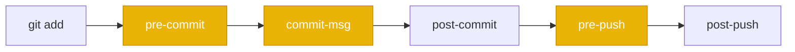
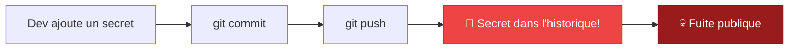
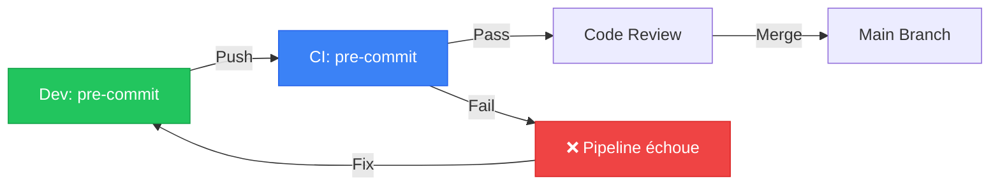

# OWASP Montréal

## Novembre 2025

<div class="text-lg mt-4 opacity-80">
  Le "Shift-Left" en pratique : Intégrer la sécurité avec les pre-commit hooks
</div>

<div class="abs-br m-6 text-xl">
  <a href="https://github.com/irishlab-io/pyquiz" target="_blank" class="slidev-icon-btn">
    <carbon:logo-github />
  </a>
</div>

<!--
Bienvenue à la conférence OWASP Montréal.
Aujourd'hui on parle de DevSecOps, plus précisément comment on peut encourager les développeurs à s'engager dans un mindset shift-left via l'utilisation de pre-commit hooks.
-->

---
transition: fade-out
layout: two-cols
layoutClass: gap-8
---

# $ whoami

**Simon HARVEY**

Conseiller principal en DevSecOps @ **Desjardins**

<div class="flex justify-center mt-12">
  
</div>

::right::

<div class="mt-12">

<div class="flex justify-center gap-8 mt-8">
  <a href="https://www.linkedin.com/in/simon-harvey-a0305029/" target="_blank" class="slidev-icon-btn">
    <carbon:logo-linkedin /> LinkedIn
  </a>
  <a href="https://github.com/irish1986" target="_blank" class="slidev-icon-btn">
    <carbon:logo-github /> GitHub
  </a>
</div>

<div class="mt-8 text-sm">

<div class="flex items-center gap-3 mb-3">
  <carbon:security class="text-blue-400 text-lg flex-shrink-0" />
  <span>Équipe de <strong>Sécurité Applicative</strong></span>
</div>

<div class="flex items-center gap-3 mb-3">
  <carbon:time class="text-blue-400 text-lg flex-shrink-0" />
  <span>20 ans en aéronautique, défense et finances</span>
</div>

<div class="flex items-center gap-3 mb-3">
  <carbon:earth class="text-blue-400 text-lg flex-shrink-0" />
  <span>Canada, États-Unis, Mexique, Irlande du Nord</span>
</div>

</div>
</div>

<!--
Bonjour je m'appelle Simon Harvey. Je travaille présentement chez Desjardins dans l'équipe de Sécurité Applicative. Précédemment, j'étais plutôt dans l'industrie aérospatiale chez Pratt & Whitney Canada ainsi que Bombardier Aéronautique.
Je ne suis pas ici pour vous vendre un outil mais plutôt partager des idées qui pourraient aider vos pratiques de développement.
-->

---
transition: fade-out
---

# Objectif de la présentation

<div class="mt-8 text-xl">

> **Vaut mieux prévenir que guérir**

</div>

<v-clicks>

<div class="mt-6">

Comment encourager les développeurs à adopter le **shift-left** via l'utilisation de **pre-commit hooks** ?

</div>

<div class="mt-6 grid grid-cols-3 gap-4">

<div class="p-4 rounded-lg bg-blue-900/30 text-center">
  <carbon:concept class="text-3xl text-blue-400 mb-2 mx-auto" />
  <div class="text-sm font-bold">Concepts</div>
  <div class="text-xs opacity-70">Shift-Left & Git Hooks</div>
</div>

<div class="p-4 rounded-lg bg-green-900/30 text-center">
  <carbon:tool-box class="text-3xl text-green-400 mb-2 mx-auto" />
  <div class="text-sm font-bold">Outils</div>
  <div class="text-xs opacity-70">Frameworks & Démo</div>
</div>

<div class="p-4 rounded-lg bg-purple-900/30 text-center">
  <carbon:deploy class="text-3xl text-purple-400 mb-2 mx-auto" />
  <div class="text-sm font-bold">Mise à l'échelle</div>
  <div class="text-xs opacity-70">CI & Considérations</div>
</div>

</div>

</v-clicks>

<!--
L'idée c'est qu'il est plus sage de prendre des mesures pour éviter un problème que d'attendre qu'il survienne pour essayer de le résoudre. C'est essentiellement le concept des pre-commit hooks.
-->

---
layout: section
---

# Introduction

## Le concept du Shift-Left

---

# Le coût des défectuosités

<div class="mt-4">

Le coût de correction d'un défaut **augmente exponentiellement** au fur et à mesure qu'il progresse dans le cycle de développement.

</div>


<div class="mt-4 text-sm opacity-80">

Source : *Applied Software Measurement: Global Analysis of Productivity and Quality* — Capers Jones

</div>

<v-click>

<div class="mt-4 p-4 rounded-lg bg-blue-900/30">

**L'idée du shift-left** : déplacer les capacités de détection "vers la gauche", plus près d'où les défectuosités sont créées et introduites dans le code.

</div>

</v-click>

<!--
Ce graphique démontre les coûts associés à l'introduction des défectuosités et où ses introductions se produisent. Dès lors, l'idée du shift-left c'est de déplacer les capacités de détection vers la gauche.
-->

---

# La charge mentale du développeur

On demande soudainement aux développeurs d'inclure de nouveaux outils et pratiques :

<v-clicks>

- ☐ Exécuter les tests unitaires localement
- ☐ Balayer les commits pour des fuites de secrets
- ☐ Lint le code selon nos conventions
- ☐ S'assurer que les CI actions sont `SHA pinned`
- ☐ Et tout le reste qu'on veut bien inventer...

</v-clicks>

<v-click>

<div class="mt-6 p-4 rounded-lg bg-red-900/30">

<carbon:warning class="text-red-400 inline" /> Cette charge mentale accrue rend l'acceptation du shift-left **difficile**.

</div>

</v-click>

<v-click>

<div class="mt-4 p-4 rounded-lg bg-green-900/30">

<carbon:idea class="text-green-400 inline" /> Les devs ne sont pas paresseux — il faut les **outiller avec des automatisations**.

</div>

</v-click>

<!--
Ces ajouts créent une charge mentale supplémentaire. Les développeurs doivent maintenant considérer une checklist et une multitude de nouvelles tâches à faire mécaniquement.
-->

---

# pyquiz — L'application de démo

<div class="grid grid-cols-2 gap-8 mt-4">

<div>

Une petite application **Python** sous forme de quiz interactif dans le terminal.

```bash
python3 apps/main.py
```

<div class="mt-4 text-sm opacity-80">

Le but : proposer une démarche **étape par étape** plutôt qu'observer passivement.

</div>

<div class="mt-4 text-sm opacity-70">

*C'est un peu comme les shows de cuisine, tout est préparé backstage.*

</div>

</div>

<div>

```python
class Quiz:
    def __init__(self, questions_file):
        self.questions = []
        self.score = 0
        self.load_questions()

    def run(self):
        self.display_welcome()
        for i, question in enumerate(
            self.questions, 1
        ):
            self.display_question(i, question)
            answer = self.get_user_answer()
            self.check_answer(answer, question)
        self.display_final_score()
```

</div>

</div>

<div class="abs-br m-6 text-sm opacity-50">

github.com/irishlab-io/pyquiz

</div>

<!--
Pour la présentation, j'ai décidé de bâtir une petite application simple en python. L'utilisation reste à contextualiser selon vos besoins et votre réalité.
-->

---
layout: section
---

# Git Hooks

## Le mécanisme natif de Git

---

# Git et ses hooks

<div class="mt-4">

~83% des développeurs utilisent **git** comme gestionnaire de version. Linus Torvalds a inclus les `git hooks` dès la première version en **2005**.

</div>

<div class="mt-4">

Les `git hooks` sont des points dans le cycle de vie du processus git qui **avant** ou **après** des actions permettent l'exécution de scripts.

</div>



<v-click>

<div class="mt-4 grid grid-cols-2 gap-4">

<div class="p-3 rounded-lg bg-red-900/30">
  <div class="font-bold text-red-400">Server-side</div>
  <div class="text-sm">S'exécute sur le serveur ⚠️ DANGER</div>
</div>

<div class="p-3 rounded-lg bg-green-900/30">
  <div class="font-bold text-green-400">Client-side</div>
  <div class="text-sm">S'exécute sur le poste du dev ← Notre sujet</div>
</div>

</div>

</v-click>

<!--
Les git hooks sont des agents d'intégration continue minimalistes. Il existe deux types : server-side et client-side. Aujourd'hui on se concentre sur le client-side.
-->

---

# Explorer `.git/hooks/`

Lorsqu'on initialise un dépôt, des exemples de hooks sont inclus :

```bash
$ ls .git/hooks/
applypatch-msg.sample     post-update.sample     pre-push.sample
commit-msg.sample         pre-applypatch.sample  pre-rebase.sample
fsmonitor-watchman.sample pre-commit.sample      prepare-commit-msg.sample
```

<v-click>

Il suffit de **retirer l'extension `.sample`** pour les activer.

</v-click>

<v-click>

<div class="mt-4">

### Notre premier hook

```bash
# Copier un hook pre-commit custom
cp docs/prep/1.1/pre-commit .git/hooks/pre-commit
chmod +x .git/hooks/pre-commit
```

</div>

</v-click>

<!--
Regardons le fonctionnement des git hooks natifs. Lorsqu'on initialise un nouveau dépôt git par défaut une pléthore de git hooks sont inclus comme exemple.
-->

---

# Évoluer le hook natif

<div class="mt-2">

Un hook plus avancé qui exécute les tests unitaires avant chaque commit :

</div>

```bash
#!/bin/bash
set -e

echo "🔍 Running pre-commit checks..."

# Run unit tests
echo "🧪 Running tests..."
python -m pytest tests/ -v --tb=short
if [ $? -ne 0 ]; then
    echo "❌ Tests failed. Commit aborted."
    exit 1
fi

echo "✅ All checks passed!"
```

<v-click>

<div class="mt-4 p-4 rounded-lg bg-yellow-900/30">

<carbon:warning class="text-yellow-400 inline" /> Cet exemple commence à inclure du error handling, des configurations... L'approche sera **lourde à orchestrer** pour toutes nos politiques.

</div>

</v-click>

<!--
On voit dans notre exemple que certains de nos tests unitaires ne fonctionnent pas. Ici nous empêchons l'ajout d'un commit supplémentaire puisque les politiques du projet imposent le succès de ceux-ci.
-->

---

# L'éléphant dans la pièce 🐘

Les `git hooks` natifs sont des **objets spéciaux** : ils ne sont pas sous contrôle de révisions.

<div class="mt-6 grid grid-cols-3 gap-4">

<div class="p-4 rounded-lg bg-red-900/30 text-center">
  <carbon:share class="text-3xl text-red-400 mb-2 mx-auto" />
  <div class="font-bold">Distribution pénible</div>
  <div class="text-sm opacity-70">Pas dans git clone</div>
</div>

<div class="p-4 rounded-lg bg-red-900/30 text-center">
  <carbon:version class="text-3xl text-red-400 mb-2 mx-auto" />
  <div class="font-bold">Pas de versionnage</div>
  <div class="text-sm opacity-70">Pas de diff / historique</div>
</div>

<div class="p-4 rounded-lg bg-red-900/30 text-center">
  <carbon:data-base class="text-3xl text-red-400 mb-2 mx-auto" />
  <div class="font-bold">Multi-dépôts</div>
  <div class="text-sm opacity-70">Installation manuelle partout</div>
</div>

</div>

<v-click>

<div class="mt-8 text-center text-xl">

Il nous faut un **framework** pour résoudre ces problèmes. 🔧

</div>

</v-click>

<!--
Les git hooks natifs ne sont pas sous contrôle des révisions ce qui amène plusieurs problèmes : la distribution est pénible, la gestion des versions et l'installation dans multiples dépôts.
-->

---
layout: section
---

# Frameworks

## Orchestrer les pre-commit hooks

---

# L'écosystème des frameworks

Une pléthore d'outils open-source tentent de résoudre ces problèmes :

<div class="mt-4 grid grid-cols-2 gap-3 text-sm">

<div class="p-3 rounded-lg bg-blue-900/30">
  <span class="font-bold text-blue-400">Pre-Commit</span> — Python, multi-langage
  <div class="text-xs opacity-60">pre-commit.com</div>
</div>

<div class="p-3 rounded-lg bg-blue-900/30">
  <span class="font-bold text-blue-400">Husky</span> — Git hooks made easy
  <div class="text-xs opacity-60">typicode.github.io/husky</div>
</div>

<div class="p-3 rounded-lg bg-gray-800/50">
  <span class="font-bold">Lefthook</span> — Fast, any project type
  <div class="text-xs opacity-60">github.com/evilmartians/lefthook</div>
</div>

<div class="p-3 rounded-lg bg-gray-800/50">
  <span class="font-bold">Prek</span> — Better pre-commit, in Rust 🦀
  <div class="text-xs opacity-60">github.com/j178/prek</div>
</div>

<div class="p-3 rounded-lg bg-gray-800/50">
  <span class="font-bold">Overcommit</span> — Configurable, extendable
  <div class="text-xs opacity-60">github.com/sds/overcommit</div>
</div>

<div class="p-3 rounded-lg bg-gray-800/50">
  <span class="font-bold">CaptainHook</span> — PHP developers
  <div class="text-xs opacity-60">github.com/captainhook-git/captainhook</div>
</div>

</div>

<v-click>

<div class="mt-4 p-3 rounded-lg bg-green-900/30 text-center">

Pour la démo, utilisons <strong class="text-green-400">Pre-Commit.com</strong> — mais tous fonctionnent avec une méthodologie similaire.

</div>

</v-click>

<!--
Une pléthore d'outils open-source tentent de résoudre ces problèmes avec différentes approches. L'objectif étant de créer un niveau d'abstraction entre le déploiement des git hooks et un framework plus neutre et convivial.
-->

---

# Installer pre-commit

<div class="mt-2">

### Étape 1 : Installation

</div>

```bash
# Via pip
pip install pre-commit

# Via uv (recommandé)
uv tool install pre-commit
```

<v-click>

<div class="mt-4">

### Étape 2 : Activer dans le dépôt

</div>

```bash
pre-commit --version
# pre-commit 4.0.1

pre-commit install --allow-missing-config
# pre-commit installed at .git/hooks/pre-commit
```

</v-click>

<v-click>

<div class="mt-4 p-3 rounded-lg bg-green-900/30">

<carbon:checkmark class="text-green-400 inline" /> Le framework est maintenant branché sur le hook `pre-commit` de git. Il ne reste qu'à le **configurer**.

</div>

</v-click>

<!--
Pour installer Pre-Commit, c'est simple. On installe le framework, puis on l'active dans le dépôt. Le framework est maintenant prêt à être configuré.
-->

---

# Configurer `.pre-commit-config.yaml`

Le fichier de configuration est **versionné** et **distribué** avec le code :

```yaml {all|2-3|4-8|all}
repos:
  - repo: https://github.com/pre-commit/pre-commit-hooks
    rev: v5.0.0
    hooks:
      - id: trailing-whitespace
      - id: end-of-file-fixer
      - id: check-yaml
      - id: check-added-large-files
```

<v-click>

<div class="mt-4 grid grid-cols-3 gap-4">

<div class="p-3 rounded-lg bg-green-900/30 text-center text-sm">
  <carbon:checkmark class="text-green-400 text-xl mb-1" />
  <div>Facile à distribuer</div>
</div>

<div class="p-3 rounded-lg bg-green-900/30 text-center text-sm">
  <carbon:version class="text-green-400 text-xl mb-1" />
  <div>Versionné dans git</div>
</div>

<div class="p-3 rounded-lg bg-green-900/30 text-center text-sm">
  <carbon:download class="text-green-400 text-xl mb-1" />
  <div>Installation simple</div>
</div>

</div>

</v-click>

<!--
On vient de déployer une configuration qui est facile à distribuer, versionner et qui s'installe facilement pour les utilisateurs.
-->

---

# Démo : Premier pre-commit en action

<div class="mt-4">

```bash
# Créer la config
cp docs/prep/2.1/not.pre-commit-config.yaml .pre-commit-config.yaml

# Faire un changement et committer
git add .
git commit -m "feat: add new feature"
```

</div>

<v-click>

<div class="mt-4 p-4 rounded-lg bg-gray-800 font-mono text-sm">

```
Trim Trailing Whitespace...............................Passed ✅
Fix End of Files.......................................Passed ✅
Check Yaml.............................................Passed ✅
Check for added large files............................Passed ✅
```

</div>

</v-click>

<v-click>

<div class="mt-4 text-center text-lg">

Le commit est **accepté** seulement si tous les hooks passent. ✅

</div>

</v-click>

<!--
Voici à quoi ressemble le premier lancement du pre-commit. Chaque hook est exécuté et si tous passent, le commit est accepté.
-->

---
layout: section
---

# Détection de secrets

## TruffleHog et pre-commit

---

# La fuite de secrets 🔐

La fuite de secrets est un des enjeux les plus populaires des dernières années.

<div class="mt-4">

Par la nature de `git`, un secret ajouté dans l'historique **ne peut pas être simplement supprimé**.

</div>



<v-click>

<div class="mt-4 p-4 rounded-lg bg-green-900/30">

**Solution** : Détecter les secrets **avant** le commit avec un pre-commit hook. Le commit est omis et la fuite est contenue **localement**.

</div>

</v-click>

<!--
La fuite de secret est clairement un des enjeux les plus populaires des dernières années. Par la nature de git un secret ajouté dans l'historique du gestionnaire de code qui fuit devient dangereux.
-->

---

# TruffleHog en pre-commit

<div class="mt-2">

Ajoutons `trufflehog` à notre configuration :

</div>

```yaml {all|5-9|all}
repos:
  - repo: https://github.com/pre-commit/pre-commit-hooks
    rev: v5.0.0
    hooks: [...]
  - repo: https://github.com/trufflesecurity/trufflehog
    rev: v3.82.13
    hooks:
      - id: trufflehog
        args: ['git', 'file:///', '--since-commit', 'HEAD']
```

<v-click>

<div class="mt-4 p-4 rounded-lg bg-gray-800 font-mono text-sm">

```
TruffleHog.............................................Failed ❌

🔑 Found credential: AWS Access Key
   File: config/settings.py
   Line: 42
```

</div>

</v-click>

<v-click>

<div class="mt-2 p-3 rounded-lg bg-green-900/30">

<carbon:checkmark class="text-green-400 inline" /> Le commit est **bloqué**. Le dev peut corriger **avant** de polluer l'historique git.

</div>

</v-click>

<!--
Un des pre-commit hooks les plus pertinents à déployer touche la détection des secrets. Maintenant à chaque commit, nous sommes en mesure de scanner le dépôt pour une fuite de secret directement sur le poste du développeur.
-->

---
layout: section
---

# Linting & Formatage

## Automatiser les conventions de code

---

# La charge mentale du formatage

La prochaine source de frustration : les **conventions de code**.

<div class="mt-4 grid grid-cols-2 gap-6">

<div>

### ❌ Sans pre-commit

```
PR Review:
├── "Fix indentation L42"
├── "Missing trailing newline"
├── "Use double quotes"
├── "Sort imports"
└── 12 autres nitpicks...
```

<div class="mt-2 text-sm text-red-400">Friction dans les code reviews</div>

</div>

<div>

### ✅ Avec pre-commit

```
$ git commit -m "feat: add feature"
ruff-format......................Fixed ✨
ruff-check.......................Passed ✅
trailing-whitespace..............Fixed ✨
```

<div class="mt-2 text-sm text-green-400">Automatique et transparent</div>

</div>

</div>

<v-click>

<div class="mt-4 p-3 rounded-lg bg-blue-900/30 text-center">

Le `pre-commit` peut **décharger mentalement** les devs et automatiser une tâche répétitive en action **automagique**.

</div>

</v-click>

<!--
La prochaine charge mentale qui touche les développeurs est souvent en lien avec les conventions de code. L'utilisation du pre-commit peut décharger mentalement ceux-ci.
-->

---

# Ajouter le linting à la config

```yaml {all|7-14|all}
repos:
  - repo: https://github.com/pre-commit/pre-commit-hooks
    rev: v5.0.0
    hooks:
      - id: trailing-whitespace
      - id: end-of-file-fixer
  - repo: https://github.com/astral-sh/ruff-pre-commit
    rev: v0.7.4
    hooks:
      - id: ruff
        args: ['--fix', '--config', '.config/ruff.toml']
      - id: ruff-format
        args: ['--config', '.config/ruff.toml']
  - repo: https://github.com/trufflesecurity/trufflehog
    rev: v3.82.13
    hooks:
      - id: trufflehog
        args: ['git', 'file:///', '--since-commit', 'HEAD']
```

<v-click>

<div class="mt-4 p-3 rounded-lg bg-blue-900/30">

<carbon:information class="text-blue-400 inline" /> Ruff corrige **automatiquement** le formatage. Le dev n'a rien à faire manuellement.

</div>

</v-click>

<!--
Ici on ajoute Ruff, un linter et formatter Python extrêmement rapide écrit en Rust. Il corrige automatiquement le formatage.
-->

---

# Exécution ad-hoc et skip

<div class="mt-2">

### Exécuter manuellement sur tous les fichiers

</div>

```bash
# Exécuter tous les hooks sur tous les fichiers
pre-commit run --all-files

# Skipper un hook spécifique
SKIP=trufflehog pre-commit run --all-files
```

<v-click>

<div class="mt-6">

### Skipper les hooks complètement

</div>

```bash
# Commit sans exécuter les hooks
git commit -m "fix: emergency hotfix" --no-verify
```

</v-click>

<v-click>

<div class="mt-4 p-4 rounded-lg bg-yellow-900/30">

<carbon:warning class="text-yellow-400 inline" /> Le `--no-verify` existe pour de bonnes raisons, mais son usage devrait être **documenté et justifié**.

</div>

</v-click>

<!--
On peut aussi exécuter les hooks manuellement, skipper certains hooks ou même skipper complètement. Le --no-verify existe pour de bonnes raisons.
-->

---

# Le concept de `stages`

Les hooks peuvent être assignés à des **étapes spécifiques** :

```yaml {all|6|10|all}
repos:
  - repo: https://github.com/astral-sh/ruff-pre-commit
    rev: v0.7.4
    hooks:
      - id: ruff
        stages: [pre-commit]    # ← Exécuté à chaque commit
      - id: ruff-format
        stages: [pre-commit]
  - repo: local
    hooks:
      - id: full-test-suite
        stages: [manual]         # ← Exécuté seulement manuellement
        entry: pytest --cov
```

<v-click>

<div class="mt-4 grid grid-cols-2 gap-4 text-sm">

<div class="p-3 rounded-lg bg-green-900/30">
  <div class="font-bold text-green-400">pre-commit</div>
  Rapide, à chaque commit
</div>

<div class="p-3 rounded-lg bg-blue-900/30">
  <div class="font-bold text-blue-400">manual</div>
  Lourd, sur demande seulement
</div>

</div>

</v-click>

<!--
Les hooks peuvent être assignés à des stages spécifiques. Certaines tâches lourdes comme les tests complets peuvent être en mode manual pour ne pas ralentir chaque commit.
-->

---

# SHA Pinning des hooks

Pour la sécurité, **épingler les versions** des hooks par SHA :

```yaml {all|3|all}
repos:
  - repo: https://github.com/pre-commit/pre-commit-hooks
    rev: "2c9f875913ee60ca25ce70243dc24571649b2225"  # v5.0.0
    hooks:
      - id: trailing-whitespace
      - id: end-of-file-fixer
```

<v-click>

<div class="mt-6 grid grid-cols-2 gap-4">

<div class="p-4 rounded-lg bg-red-900/30">
  <div class="font-bold text-red-400">❌ Tags seuls</div>
  <div class="text-sm mt-2">
  Un tag peut être déplacé vers un commit malicieux
  </div>
</div>

<div class="p-4 rounded-lg bg-green-900/30">
  <div class="font-bold text-green-400">✅ SHA pinning</div>
  <div class="text-sm mt-2">
  Un SHA est immutable et vérifiable
  </div>
</div>

</div>

</v-click>

<v-click>

<div class="mt-4 text-sm opacity-80">

Des outils comme `pre-commit autoupdate` peuvent aider à maintenir les versions à jour.

</div>

</v-click>

<!--
Nouvelle politique que les CI actions doivent être SHA pinned. La même logique s'applique aux hooks pre-commit. Traiter les pre-commits hooks comme les dépendances logicielles.
-->

---
layout: section
---

# CI et mise à l'échelle

## Du poste local au pipeline

---

# Du local au CI

<div class="mt-4">

Avec notre modèle de `pre-commit hooks`, nous outillons les devs pour réduire le volume de bugs **à la source**.

</div>

<v-click>

<div class="mt-4 p-4 rounded-lg bg-yellow-900/30">

**Rappel** : l'utilisation de `pre-commit` est un **choix**, pas une obligation. Le `--no-verify` existe.

</div>

</v-click>

<v-click>

<div class="mt-6">



</div>

</v-click>

<v-click>

<div class="mt-4 text-center">

L'objectif c'est la **qualité du code**, pas d'exécuter des pre-commit hooks.

</div>

</v-click>

<!--
L'objectif à atteindre c'est la qualité du code et non d'exécuter des pre-commit hooks. Pour certains les manœuvres sont une deuxième nature, pour d'autres la raison n'est pas pertinente.
-->

---

# Répliquer dans le CI pipeline

<div class="mt-2">

Comment s'assurer que la qualité est atteinte ? On réplique les hooks dans le CI :

</div>

```yaml
# .github/workflows/pr.yml
name: Pre-commit checks
on: [pull_request]

jobs:
  pre-commit:
    runs-on: ubuntu-latest
    steps:
      - uses: actions/checkout@v4
      - uses: actions/setup-python@v5
        with:
          python-version: '3.13'
      - uses: pre-commit/action@v3.0.1
```

<v-click>

<div class="mt-4 p-3 rounded-lg bg-blue-900/30">

Si un dev oublie ou décide de ne pas exécuter le framework localement → le **CI pipeline échoue** → la première question en code review : *"Pourquoi as-tu skippé tes pre-commit ?"*

</div>

</v-click>

<!--
Comment peut-on s'assurer que la qualité est atteinte ? On réplique les actions des pre-commit hooks dans le CI pipeline et on documente.
-->

---

# Documenter les pratiques

<div class="mt-4 grid grid-cols-2 gap-6">

<div>

### `CONTRIBUTING.md`

```markdown
## Pre-commit Hooks

Ce projet utilise `pre-commit` pour
assurer la qualité du code.

### Installation
pip install pre-commit
pre-commit install

### En cas de problème
SKIP=hook_id git commit -m "msg"

⚠️ Justifier tout usage de --no-verify
```

</div>

<div>

### `PULL_REQUEST_TEMPLATE.md`

```markdown
## Checklist

- [ ] pre-commit hooks exécutés
- [ ] Tests passent localement
- [ ] Pas de secrets dans le code
- [ ] Documentation mise à jour

## Si --no-verify utilisé
Raison : _______________
```

</div>

</div>

<v-click>

<div class="mt-4 p-3 rounded-lg bg-green-900/30 text-center text-sm">

La documentation crée une **culture** et ouvre la **discussion** sur les pratiques de qualité.

</div>

</v-click>

<!--
On réplique les actions des pre-commit hooks dans le CI pipeline et on documente avec CONTRIBUTING.md et PULL_REQUEST_TEMPLATE.md.
-->

---

# Quand le CI échoue

<div class="mt-4">

Il peut y avoir d'excellentes raisons pour un `--no-verify` :

</div>

<v-clicks>

- 🚨 Une situation **break the glass** (urgence production)
- 🤔 Contester certaines configurations relatives aux hooks
- 🔄 Refactoring massif en cours
- 🐛 Faux positif d'un hook

</v-clicks>

<v-click>

<div class="mt-6 p-4 rounded-lg bg-blue-900/30">

<carbon:chat class="text-blue-400 inline" /> L'important c'est qu'une **discussion s'ouvre**. Le CI est le filet de sécurité.

</div>

</v-click>

<v-click>

<div class="mt-4 p-3 rounded-lg bg-yellow-900/30 text-sm">

**Finalement** : le `pre-commit` en mode CI devrait se faire de manière réfléchie. Certaines tâches ont avantage à être exécutées via des **actions et scripts plus complexes**.

</div>

</v-click>

<!--
Maintenant si un dev oublie ou décide de ne pas exécuter le framework de pre-commit localement, le CI pipeline échoue et la première question devrait être... Pourquoi as-tu skippé tes pre-commit.
-->

---
layout: section
---

# Considérations

## Avant de se lancer

---

# Considération : Sécurité

<div class="mt-6 grid grid-cols-2 gap-8">

<div class="p-6 rounded-lg bg-red-900/20">

### ⚠️ Le risque

Êtes-vous prêt à exécuter des **scripts arbitraires** sur vos codes sources ?

<div class="mt-4 text-sm opacity-80">

Les hooks exécutent du code tiers sur chaque commit...

</div>

</div>

<div class="p-6 rounded-lg bg-green-900/20">

### ✅ La mitigation

Traiter les `pre-commit hooks` comme les **dépendances logicielles** :

<div class="mt-4 text-sm">

- Proxy / hosting interne
- Audit pré-adoption
- SHA pinning
- Revue régulière

</div>

</div>

</div>

<!--
Sécurité : Êtes-vous prêt à exécuter des scripts arbitraires sur vos codes sources ? Traiter les pre-commits hooks comme les dépendances logicielles.
-->

---

# Considération : Performance

<div class="mt-6 grid grid-cols-2 gap-8">

<div class="p-6 rounded-lg bg-yellow-900/20">

### ⏱️ Le coût

Êtes-vous prêt à **perdre 5-10 secondes** à chaque `git commit` ?

<div class="mt-4 text-sm opacity-80">

Les hooks ajoutent de la latence au workflow quotidien du développeur.

</div>

</div>

<div class="p-6 rounded-lg bg-green-900/20">

### 🚀 L'optimisation

<div class="mt-4 text-sm">

- Réduire l'empreinte au minimum (sécurité, formatage)
- Utiliser les `stages: [manual]` pour les tâches lourdes
- Considérer un framework plus performant (`prek` en Rust)
- Ne passer que les fichiers modifiés

</div>

</div>

</div>

<!--
Performance : Êtes-vous prêt à perdre 5-10sec à chaque git commit ? Réduire l'empreinte des hooks au minimum.
-->

---

# Considération : Irritation

<div class="mt-6 grid grid-cols-2 gap-8">

<div class="p-6 rounded-lg bg-orange-900/20">

### 😤 La friction

Êtes-vous prêt à **irriter les devs** à chaque `git commit` ?

<div class="mt-4 text-sm opacity-80">

Les faux positifs et les hooks trop stricts créent de la résistance.

</div>

</div>

<div class="p-6 rounded-lg bg-green-900/20">

### 🤝 L'approche

<div class="mt-4 text-sm">

- Commencer à **petits pas**
- L'embarquement prendra du temps
- Rendre la pratique **facultative** au début
- Écouter le feedback des devs
- Itérer sur la configuration

</div>

</div>

</div>

<v-click>

<div class="mt-6 p-4 rounded-lg bg-blue-900/30 text-center">

Le shift-left est un **voyage**, pas une destination. 🧭

</div>

</v-click>

<!--
Irritation : Êtes-vous prêt à irriter les devs à chaque git commit ? Commencer à petits pas, l'embarquement de cette méthodologie prendra un peu de temps et surtout la rendre facultative.
-->

---

# Récapitulatif

<div class="mt-4 grid grid-cols-2 gap-6">

<div>

### Ce qu'on a vu

<v-clicks>

- 📊 Le coût du shift-left
- 🔧 Les git hooks natifs et leurs limites
- 🛠️ Les frameworks (pre-commit.com)
- 🔐 Détection de secrets (TruffleHog)
- ✨ Linting automatique (Ruff)
- ⏭️ Skip, stages et SHA pinning
- 🔄 CI pipeline et mise à l'échelle
- 📝 Documentation et culture

</v-clicks>

</div>

<div>

### Les points clés

<v-clicks>

<div class="p-3 rounded-lg bg-green-900/30 mb-2 text-sm">
  Automatiser pour réduire la <strong>charge mentale</strong>
</div>

<div class="p-3 rounded-lg bg-blue-900/30 mb-2 text-sm">
  Commencer <strong>petit</strong> et itérer
</div>

<div class="p-3 rounded-lg bg-purple-900/30 mb-2 text-sm">
  Le CI est le <strong>filet de sécurité</strong>
</div>

<div class="p-3 rounded-lg bg-yellow-900/30 mb-2 text-sm">
  La qualité, pas la <strong>conformité</strong>
</div>

</v-clicks>

</div>

</div>

<!--
Pour récapituler, on a vu les concepts du shift-left, les git hooks natifs, les frameworks, la détection de secrets, le linting, et comment mettre à l'échelle via le CI.
-->

---
layout: center
class: text-center
---

# Merci ! 🙏

<div class="mt-8 grid grid-cols-3 gap-8">

<div>
  <carbon:logo-github class="text-4xl mb-2" />
  <div class="text-sm">

[irishlab-io/pyquiz](https://github.com/irishlab-io/pyquiz)

  </div>
</div>

<div>
  <carbon:logo-linkedin class="text-4xl mb-2" />
  <div class="text-sm">

[simon-harvey](https://www.linkedin.com/in/simon-harvey-a0305029/)

  </div>
</div>

<div>
  <carbon:globe class="text-4xl mb-2" />
  <div class="text-sm">

[irishlab.io](https://irishlab.io)

  </div>
</div>

</div>

<div class="mt-12 text-2xl">

**Questions ?** 🤔

</div>

<!--
Merci pour votre attention. Le code de la démo est disponible sur GitHub. N'hésitez pas à poser vos questions.
-->
