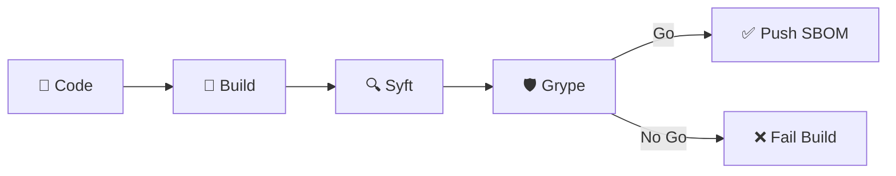

# OWASP Montréal

## March 2026

<div class="text-lg mt-4 opacity-80">
  It's SBOM, but is your SBOM good?
</div>

<div class="abs-br m-6 text-xl">
  <a href="https://github.com/irishlab-io/blog" target="_blank" class="slidev-icon-btn">
    <carbon:logo-github />
  </a>
</div>

<!--
Welcome to the OWASP Montréal conference

Thanks to Cybereco for lending us the space and to Samuel and Jonathan from the OWASP Montréal chapter for organizing

Today we're talking about software nomenclature more commonly called Software Bill of Material (SBOM).
-->

---
layout: two-cols
layoutClass: gap-8
---

# $ whoami

**Simon HARVEY**

Principal DevSecOps Advisor @ **Desjardins**

<div class="flex justify-center mt-18">
  
</div>

::right::

<div class="mt-12">

<div class="flex justify-center gap-8 mt-8">
  <a href="https://www.linkedin.com/in/simon-harvey-a0305029/" target="_blank" class="slidev-icon-btn">
    <carbon:logo-linkedin /> LinkedIn
  </a>
  <a href="https://github.com/irish1986" target="_blank" class="slidev-icon-btn">
    <carbon:logo-github /> GitHub
  </a>
</div>

<div class="mt-8 text-sm">

<div class="flex items-center gap-3 mb-3">
  <carbon:security class="text-blue-400 text-lg flex-shrink-0" />
  <span><strong>Application Security</strong> Team</span>
</div>

<div class="flex items-center gap-3 mb-3">
  <carbon:time class="text-blue-400 text-lg flex-shrink-0" />
  <span>20 years in aerospace, defense and finance</span>
</div>

<div class="flex items-center gap-3 mb-3">
  <carbon:earth class="text-blue-400 text-lg flex-shrink-0" />
  <span>Canada, United States, Mexico and Northern Ireland</span>
</div>

<div class="flex items-center gap-3">
  <carbon:deploy class="text-blue-400 text-lg flex-shrink-0" />
  <span>DevSecOps, CI/CD, SDLC, Supply Chain Security</span>
</div>

</div>

</div>

<!--
Quick introduction about me, my name is Simon HARVEY and I'm a Principal DevSecOps Advisor at Desjardins.

I'm part of the Application Security team and our mandate is to improve practices and support software development teams.

I've been in IT for 20 years, early in my career mostly in aerospace and defense.

You can find me on LinkedIn or GitHub.
-->

---

# Agenda

<div class="grid grid-cols-2 gap-x-8 gap-y-4 mt-8">

<div class="flex items-start gap-4 p-3 rounded-lg bg-blue-500/10 border-l-3 border-blue-400">
  <div class="text-xl font-bold opacity-40">01</div>
  <div>
    <div class="font-bold">Gastronomy vs SBOM</div>
    <div class="text-sm opacity-60">Understanding the concept</div>
  </div>
</div>

<div class="flex items-start gap-4 p-3 rounded-lg bg-blue-500/10 border-l-3 border-blue-400">
  <div class="text-xl font-bold opacity-40">02</div>
  <div>
    <div class="font-bold">What is an SBOM?</div>
    <div class="text-sm opacity-60">Formats, regulations and events</div>
  </div>
</div>

<div class="flex items-start gap-4 p-3 rounded-lg bg-green-500/10 border-l-3 border-green-400">
  <div class="text-xl font-bold opacity-40">03</div>
  <div>
    <div class="font-bold">Generate and Analyze</div>
    <div class="text-sm opacity-60">Syft, Grype and CI integration</div>
  </div>
</div>

<div class="flex items-start gap-4 p-3 rounded-lg bg-purple-500/10 border-l-3 border-purple-400">
  <div class="text-xl font-bold opacity-40">04</div>
  <div>
    <div class="font-bold">Store your SBOMs</div>
    <div class="text-sm opacity-60">OWASP Dependency-Track</div>
  </div>
</div>

<div class="flex items-start gap-4 p-3 rounded-lg bg-orange-500/10 border-l-3 border-orange-400">
  <div class="text-xl font-bold opacity-40">05</div>
  <div>
    <div class="font-bold">Start Remediation</div>
    <div class="text-sm opacity-60">What to do and automation</div>
  </div>
</div>

<div class="flex items-start gap-4 p-3 rounded-lg bg-teal-500/10 border-l-3 border-teal-400">
  <div class="text-xl font-bold opacity-40">06</div>
  <div>
    <div class="font-bold">Summary</div>
    <div class="text-sm opacity-60">The complete SBOM lifecycle</div>
  </div>
</div>

</div>

<!--
Quick overview of our agenda, we're planning 45-60min today to talk about SBOMs so that's a lot of material to cover.
-->

---
layout: center
class: text-center
---

# Part 1

## Software Nomenclature

<div class="mt-8 text-sm opacity-60">

Software Bill of Material?

</div>

---

# Gastronomy vs SBOM

Every dish is made of an **ingredient list** — why know it?

<div class="grid grid-cols-2 gap-6 mt-8">

<div v-click class="flex items-start gap-4 p-4 rounded-lg bg-blue-500/10 border-l-3 border-blue-400">
  <div class="text-3xl flex-shrink-0">🍽️</div>
  <div>
    <div class="font-bold text-blue-300">Preferences</div>
    <div class="text-sm opacity-75 mt-1">Some customers don't like certain foods and want to <strong>know</strong> what's in each dish.</div>
  </div>
</div>

<div v-click class="flex items-start gap-4 p-4 rounded-lg bg-green-500/10 border-l-3 border-green-400">
  <div class="text-3xl flex-shrink-0">🥬</div>
  <div>
    <div class="font-bold text-green-300">Freshness</div>
    <div class="text-sm opacity-75 mt-1">Some diners choose a place for the techniques used during <strong>preparation</strong>.</div>
  </div>
</div>

<div v-click class="flex items-start gap-4 p-4 rounded-lg bg-purple-500/10 border-l-3 border-purple-400">
  <div class="text-3xl flex-shrink-0">🌱</div>
  <div>
    <div class="font-bold text-purple-300">Beliefs</div>
    <div class="text-sm opacity-75 mt-1">Vegetarians/vegans, religious or ethical — they need to <strong>verify</strong> the dish respects their principles.</div>
  </div>
</div>

<div v-click class="flex items-start gap-4 p-4 rounded-lg bg-red-500/10 border-l-3 border-red-400">
  <div class="text-3xl flex-shrink-0">🚨</div>
  <div>
    <div class="font-bold text-red-300">Allergies</div>
    <div class="text-sm opacity-75 mt-1">Allergies and intolerances — a hidden ingredient can be <strong>deadly</strong>.</div>
  </div>
</div>

</div>

<!--
Small analogy between gastronomy and SBOM.
-->

---

# What is an SBOM?

A **Software Bill of Materials** — the inventory of all components and dependencies of your software.

<div class="grid grid-cols-1 gap-3 mt-8">

<div v-click class="flex items-center gap-3 p-3 rounded-lg bg-blue-500/10 border-l-3 border-blue-400">
  <div class="text-xl flex-shrink-0">📜</div>
  <div><strong class="text-blue-300">Regulatory compliance</strong> — <a href="https://www.nist.gov/itl/executive-order-14028-improving-nations-cybersecurity">US EO 14028</a>, <a href="https://eur-lex.europa.eu/eli/reg/2024/2847/oj">EU Cyber Resilience Act</a>, <span class="line-through opacity-50">Canadian Bill C-26</span></div>
</div>

<div v-click class="flex items-center gap-3 p-3 rounded-lg bg-green-500/10 border-l-3 border-green-400">
  <div class="text-xl flex-shrink-0">🔗</div>
  <div><strong class="text-green-300">Supply chain</strong> — Understand what's included in our products</div>
</div>

<div v-click class="flex items-center gap-3 p-3 rounded-lg bg-orange-500/10 border-l-3 border-orange-400">
  <div class="text-xl flex-shrink-0">⚙️</div>
  <div><strong class="text-orange-300">Operational risks</strong> — Keep libraries and modules up to date</div>
</div>

<div v-click class="flex items-center gap-3 p-3 rounded-lg bg-red-500/10 border-l-3 border-red-400">
  <div class="text-xl flex-shrink-0">🛡️</div>
  <div><strong class="text-red-300">Vulnerabilities</strong> — Quickly identify which applications are affected</div>
</div>

<div v-click class="flex items-center gap-3 p-3 rounded-lg bg-purple-500/10 border-l-3 border-purple-400">
  <div class="text-xl flex-shrink-0">⚖️</div>
  <div><strong class="text-purple-300">Licenses</strong> — Permissibility to use certain dependencies in certain contexts</div>
</div>

</div>

<!--
Explain what an SBOM is.
-->

---

# SBOM Formats

Three main standards to describe your software components.

<div class="grid grid-cols-3 gap-6 mt-8">

<div v-click class="p-5 rounded-lg bg-green-500/10 border-l-3 border-green-400">
  <div class="font-bold text-3xl text-green-300">CycloneDX</div>
  <div class="text-xs opacity-50 mb-3">OWASP</div>
  <ul class="text-sm opacity-75 space-y-1">
    <li>Lightweight and modern</li>
    <li>Designed for application security</li>
    <li>Ideal for CI/CD</li>
    <li>Supports software, services, hardware</li>
  </ul>
</div>

<div v-click class="p-5 rounded-lg bg-blue-500/10 border-l-3 border-blue-400">
  <div class="font-bold text-3xl  text-blue-300">SPDX</div>
  <div class="text-xs opacity-50 mb-3">Linux Foundation</div>
  <ul class="text-sm opacity-75 space-y-1">
    <li>ISO/IEC 5962:2021 standard</li>
    <li>License & intellectual property oriented</li>
    <li>Detailed legal compliance</li>
  </ul>
</div>

<div v-click class="p-5 rounded-lg bg-orange-500/10 border-l-3 border-orange-400">
  <div class="font-bold text-3xl text-orange-300">SWID Tags</div>
  <div class="text-xs opacity-50 mb-3">ISO/IEC 19770-2</div>
  <ul class="text-sm opacity-75 space-y-1">
    <li>Identity & version tags</li>
    <li>Not a complete SBOM</li>
    <li>Complementary to other formats</li>
  </ul>
</div>

</div>

<!--
For most of you, the CycloneDX format is the most practical but depending on the product you're building, you might lean towards other formats.
-->

---

# The Toolbox

[Anchore](https://anchore.com/) produces two rather practical software related to SBOMs.

<div class="grid grid-cols-2 gap-8 mt-8">
<div>

<v-click>
<div class="flex items-center justify-center gap-3 mb-4">
  
  <span class="text-2xl font-bold">Syft</span>
</div>

**SBOM Generation**

- CLI for containers, filesystems, archives and more
- Covers a dozen ecosystems (Alpine (apk), Debian (dpkg), Go, Python, Java, JavaScript, Rust, PHP, .NET, and more)
- Supports multiple formats (CycloneDX, SPDX, Syft JSON, and more)

```bash
curl -sSfL https://get.anchore.io/syft \
  | sudo sh -s -- -b /usr/local/bin
grype syft
```

</v-click>
</div>
<div>

<v-click>
<div class="flex items-center justify-center gap-3 mb-4">
  
  <span class="text-2xl font-bold">Grype</span>
</div>

**Vulnerability Scanner**

- Scans images, filesystems and SBOMs for known vulnerabilities
- Multiple CVE databases
- Prioritizes findings and risks via CVE, CVSS, EPSS, KEV and more
- Automatically updated database

```bash
curl -sSfL https://get.anchore.io/grype \
  | sudo sh -s -- -b /usr/local/bin
grype version
```

</v-click>
</div>
</div>

<!--
So as usual, I'm not here to sell anything... So I'll talk about open-source tools (Apache 2.0).

Anchore offers two software for generating and analyzing SBOMs.
-->

---

# Demo | Syft

A quick demo on using Syft.

<div class="mt-8">

```bash
syft scan docker.io/python:3.10.11-bullseye
```

</div>

<div class="mt-4">

```bash {all|1-7|8-12|13}
 ✔ Loaded image     index.docker.io/library/python:3.10.11-bullseye
 ✔ Parsed image     sha256:df5a406e13...
 ✔ Cataloged contents  234638db60e254...
   ├── ✔ Packages                        [445 packages]
   ├── ✔ Executables                     [1,412 executables]
   ├── ✔ File metadata                   [19,451 locations]
   └── ✔ File digests                    [19,451 files]
NAME                          VERSION            TYPE
apt                           2.2.4              deb
automake                      1:1.16.3-2         deb
autotools-dev                 20180224.1+nmu1    deb
bash                          5.1-2+deb11u1      deb
... and many more
```

</div>

<div class="mt-4">

```bash
syft scan docker.io/python:3.10.11-bullseye --output cyclonedx-json=sbom.json
```

</div>

<!--
Live demo.

Talk 30 sec about IBC.
-->

---

# Demo | Grype

A quick demo on using Grype.

<div class="mt-8">

```bash
grype docker.io/python:3.10.11-bullseye
```

</div>

<div class="mt-4">

```bash {all|1-3|4-11|12}
 ✔ Scanned for vulnerabilities     [3104 vulnerability matches]
   ├── by severity: 224 critical, 1840 high, 3128 medium, 177 low, 1084 negligible (719 unknown)
   └── by status:   4123 fixed, 3049 not-fixed, 4068 ignored (1 dropped)
NAME              INSTALLED              FIXED IN               TYPE VULNERABILITY   SEVERITY  EPSS          RISK
libwebp-dev       0.6.1-2.1+deb11u1      0.6.1-2.1+deb11u2      deb  CVE-2023-4863   High      93.6% (99th)  85.6  KEV
libwebp6          0.6.1-2.1+deb11u1      0.6.1-2.1+deb11u2      deb  CVE-2023-4863   High      93.6% (99th)  85.6  KEV
libfreetype-dev   2.10.4+dfsg-1+deb11u1  2.10.4+dfsg-1+deb11u2  deb  CVE-2025-27363  High      76.2% (98th)  81.9  KEV
git               1:2.30.2-1+deb11u2     1:2.30.2-1+deb11u3     deb  CVE-2024-32002  Critical  80.4% (99th)  72.3
git-man           1:2.30.2-1+deb11u2     1:2.30.2-1+deb11u3     deb  CVE-2024-32002  Critical  80.4% (99th)  72.3
libc-bin          2.31-13+deb11u6        2.31-13+deb11u9        deb  CVE-2024-2961   High      92.8% (99th)  68.7
libc-dev-bin      2.31-13+deb11u6        2.31-13+deb11u9        deb  CVE-2024-2961   High      92.8% (99th)  68.7
... and many more
```

</div>

<v-click>

<div class="flex justify-center gap-3 mt-6">
  <div class="px-4 py-2 rounded-lg bg-red-600/20 border border-red-500 text-center">
    <div class="text-2xl font-bold text-red-400">224</div>
    <div class="text-xs opacity-75">Critical</div>
  </div>
  <div class="px-4 py-2 rounded-lg bg-orange-500/20 border border-orange-500 text-center">
    <div class="text-2xl font-bold text-orange-400">1840</div>
    <div class="text-xs opacity-75">High</div>
  </div>
  <div class="px-4 py-2 rounded-lg bg-yellow-500/20 border border-yellow-500 text-center">
    <div class="text-2xl font-bold text-yellow-400">3128</div>
    <div class="text-xs opacity-75">Medium</div>
  </div>
  <div class="px-4 py-2 rounded-lg bg-blue-500/20 border border-blue-500 text-center">
    <div class="text-2xl font-bold text-blue-400">177</div>
    <div class="text-xs opacity-75">Low</div>
  </div>
  <div class="px-4 py-2 rounded-lg bg-gray-500/20 border border-gray-500 text-center">
    <div class="text-2xl font-bold text-gray-400">1084</div>
    <div class="text-xs opacity-75">Trivial</div>
  </div>
</div>

</v-click>

<!--
Live demo.
-->

---

# CI/CD Integration

Generating an SBOM in a pipeline is **3 small extra steps** in your CI:

<div class="mt-8">



</div>

<v-click>

<div class="mt-6">

The blocking threshold based on CVE criticality encountered is configured as follows:

```bash
grype sbom:sbom.json --fail-on <-severity->
```

</div>

</v-click>

<v-click>

<div class="grid grid-cols-3 gap-3 mt-4 text-center text-sm">
  <div class="p-2 rounded-lg bg-blue-500/10 border border-blue-500/30">
    <div class="font-bold text-blue-300">Feature branch</div>
    <div class="text-xs opacity-60"><code>--fail-on critical</code></div>
  </div>
  <div class="p-2 rounded-lg bg-orange-500/10 border border-orange-500/30">
    <div class="font-bold text-orange-300">Dev branch</div>
    <div class="text-xs opacity-60"><code>--fail-on high</code></div>
  </div>
  <div class="p-2 rounded-lg bg-red-500/10 border border-red-500/30">
    <div class="font-bold text-red-300">Main branch</div>
    <div class="text-xs opacity-60"><code>--fail-on medium</code></div>
  </div>
</div>

</v-click>

<!--
Include SBOM generation and analysis in your integration pipelines.
-->

---

# Vulnerabilities

Four essential acronyms to understand and prioritize vulnerabilities:

<div class="grid grid-cols-4 gap-4 mt-8">

<div v-click class="p-4 rounded-lg bg-blue-500/10 border-l-3 border-blue-400">
  <div class="font-bold text-xl text-blue-300 mb-2">CVE</div>
  <div class="text-xs opacity-50 mb-2">Common Vulnerabilities and Exposures</div>
  <div class="text-sm opacity-75">
    <strong>Unique identifier</strong> for each known vulnerability (ex: <code>CVE-2024-6119</code>). Managed by NVD, it's the <strong>ID card</strong> of a flaw.
  </div>
  <div class="mt-3 p-2 bg-blue-500/10 rounded text-xs opacity-60">
    <strong>"What is this flaw?"</strong>
  </div>
</div>

<div v-click class="p-4 rounded-lg bg-orange-500/10 border-l-3 border-orange-400">
  <div class="font-bold text-xl text-orange-300 mb-2">CVSS</div>
  <div class="text-xs opacity-50 mb-2">Common Vulnerability Scoring System</div>
  <div class="text-sm opacity-75">
    Score from <strong>0.0 to 10.0</strong> measuring technical severity. Evaluates attack vector, complexity and impact.
  </div>
  <div class="mt-3 grid grid-cols-2 gap-1 text-xs">
    <span class="px-1 rounded bg-red-600/30 text-red-300">Critical</span>
    <span class="px-1 rounded bg-orange-500/30 text-orange-300">High</span>
    <span class="px-1 rounded bg-yellow-500/30 text-yellow-300">Medium</span>
    <span class="px-1 rounded bg-blue-500/30 text-blue-300">Low</span>
  </div>
  <div class="mt-2 p-2 bg-orange-500/10 rounded text-xs opacity-60">
    <strong>"How serious is it?"</strong>
  </div>
</div>

<div v-click class="p-4 rounded-lg bg-green-500/10 border-l-3 border-green-400">
  <div class="font-bold text-xl text-green-300 mb-2">EPSS</div>
  <div class="text-xs opacity-50 mb-2">Exploit Prediction Scoring System</div>
  <div class="text-sm opacity-75">
    Probability (<strong>0 to 100%</strong>) that a CVE will be <strong>exploited in the next 30 days</strong>. Based on projections and real threat data.
  </div>
  <div class="mt-3 p-2 bg-green-500/10 rounded text-xs opacity-60">
    <strong>"Will we get attacked?"</strong>
  </div>
</div>

<div v-click class="p-4 rounded-lg bg-red-500/10 border-l-3 border-red-400">
  <div class="font-bold text-xl text-red-300 mb-2">KEV</div>
  <div class="text-xs opacity-50 mb-2">Known Exploited Vulnerabilities</div>
  <div class="text-sm opacity-75">
    <strong>CISA</strong> catalog listing CVEs <strong>actively exploited</strong> in the wild. If your CVE is in KEV, it's an emergency.
  </div>
  <div class="mt-3 p-2 bg-red-500/10 rounded text-xs opacity-60">
    <strong>"Is it already being exploited?"</strong>
  </div>
</div>

</div>

<v-click>

<div class="mt-6 p-3 bg-purple-500/10 rounded-lg text-sm text-center">

**CVSS** gives severity, **EPSS** estimates probability, **KEV** confirms exploitation — combine all three to **prioritize effectively**

</div>

</v-click>

---

# Artifact Degradation

Software **degrades over time** — new CVEs appear constantly.

<div class="flex items-center justify-between mt-8 px-4">

<v-click>
  <div class="text-center p-4 rounded-xl bg-green-500/20 border-2 border-green-400 w-40">
    <div class="font-bold text-green-300">Day 0</div>
    <div class="text-2xl font-bold text-green-400 mt-1">4</div>
    <div class="text-xs opacity-60">CVEs</div>
  </div>

</v-click>

<v-click>
  <div class="text-sm opacity-50 flex flex-col items-center">
    <span class="text-xs">3 months</span>
  </div>

</v-click>

<v-click>
  <div class="text-center p-4 rounded-xl bg-yellow-500/20 border-2 border-yellow-400 w-40">
    <div class="font-bold text-yellow-300">Month 3</div>
    <div class="text-2xl font-bold text-yellow-400 mt-1">12</div>
    <div class="text-xs opacity-60">CVEs</div>
  </div>

</v-click>

<v-click>
  <div class="text-sm opacity-50 flex flex-col items-center">
    <span class="text-xs">6 months</span>
  </div>

</v-click>

<v-click>
  <div class="text-center p-4 rounded-xl bg-orange-500/20 border-2 border-orange-400 w-40">
    <div class="font-bold text-yellow-300">Month 9</div>
    <div class="text-2xl font-bold text-orange-400 mt-1">45</div>
    <div class="text-xs opacity-60">CVEs</div>
  </div>

</v-click>

<v-click>
  <div class="text-sm opacity-50 flex flex-col items-center">
    <span class="text-xs">12 months</span>
  </div>

</v-click>

<v-click>
  <div class="text-center p-4 rounded-xl bg-red-500/20 border-2 border-red-400 w-40">
    <div class="font-bold text-yellow-300">Year 1</div>
    <div class="text-2xl font-bold text-red-400 mt-1">119</div>
    <div class="text-xs opacity-60">CVEs</div>
  </div>

</v-click>
</div>

<v-click>
<div class="mt-8 p-3">

- Regularly rescan your products for **new vulnerabilities**
- Store your SBOMs for **medium to long term** scanning
- At scale, scanning SBOMs is **much faster** than scanning full artifacts

</div>

</v-click>

<!--
Vulnerabilities evolve over time. It's an endless battle.
-->

---
layout: center
class: text-center
---

# Part 2

## OWASP Dependency-Track

<div class="mt-8 text-sm opacity-60">

From one-time generation to **continuous monitoring**

</div>

---

# The Storage Problem

Where to put all these SBOMs and how to store them?

<div class="grid grid-cols-3 gap-4 mt-8">
<div v-click class="p-4 rounded-lg bg-gray-500/10 border-l-3 border-gray-400 text-center opacity-50">

### Storage?
📦
<div class="text-sm mt-2">Passive without monitoring</div>

</div>
<div v-click class="p-4 rounded-lg bg-gray-500/10 border-l-3 border-gray-400 text-center opacity-50">

### Registry?
🗄️
<div class="text-sm mt-2">Tied to build, no overview</div>

</div>
<div v-click class="p-4 rounded-lg bg-gray-500/10 border-l-3 border-gray-400 text-center opacity-50">

### Logs?
📋
<div class="text-sm mt-2">Ephemeral, scattered and hard to scale</div>

</div>
</div>

<!--
As explained earlier, we want to keep our SBOMs in order to

Whether it's to be able to re-evaluate them periodically or in connection with an event (publicized vulnerability).
-->

---

# OWASP Dependency-Track

An **OWASP Flagship Project** that can be quickly deployed via `Docker Compose`:

<div class="grid grid-cols-2 gap-6 mt-12">

<v-click>
<div class="text-sm self-center">

- **SBOM Repository**
- **Dashboard**
- **Policy Management**
- **Continuous Monitoring**
- **API-driven and Automation**
- **Apache 2.0**

</div>

</v-click>

<v-click>
<div class="text-sm">

```yaml
---
# compose.yml
# docker compose up
services:
  dtrack:
    container_name: dependencytrack
    image: docker.io/dependencytrack/bundled:latest
    deploy:
      resources:
        limits:
          memory: 12288m
        reservations:
          memory: 8192m
    ports:
      - 8080:8080
    volumes:
      - dependency-track:/data
    restart: unless-stopped
```

</div>
</v-click>
</div>

<!--
If you want to test OWASP Dependency Track, there are several hosting options (docker, k8s, helm).

For the backend, there are several database options (postgres, mssql, etc...)

It's a fairly simple service to stand up that can help centralize different processes around SBOMs.
-->

---

# Demo | OWASP D-Track

A quick demo on using Dependency Track.

<div class="grid grid-cols-2 gap-8 mt-8">

<v-clicks>
<div>

### Portfolio


- Global view, by collection or by project
- Project, component, and vulnerability info
- Risk score trends
- Impact analysis


</div>
</v-clicks>
<v-clicks>
<div>

### Policy Engine


- **Security**: CVE, CVSS, EPSS, etc...
- **Licenses**: Strong Copyleft or Risky License
- **Operational**: Trusted sources, EOL, updates, etc...


</div>
</v-clicks>
</div>

<v-clicks>
<div class="mt-8">

```bash
dtrack-cli --server ${DEPENDENCYTRACK_URL} \
  --api-key ${DEPENDENCYTRACK_TOKEN}  \
  --project-name "A-demo-test" --project-version "0.0.1" \
  --bom-path sbom.json --auto-create true
```

</div>
</v-clicks>

<!--
https://dependencytrack.local.irishlab.io/

Dependency Check 12.2.0 project as example

Show an API example
-->

---
layout: center
class: text-center
---

# Part 3

## Remediation

<div class="mt-8 text-sm opacity-60">

Detecting is good; **fixing** is better.

</div>

---

# Example of a Fictionally Real Project

[**Insecure Bank Corporation**](https://github.com/irishlab-io/ibc) — a deliberately vulnerable Django application for educational purposes.

<div class="mt-8">

- A **Django 4.2.4** web application in **Python 3.10**
- Several vulnerable dependencies (PyYAML 5.3.1, etc.)
- Heavy container image `python:3.10.11-bullseye`

</div>

<div class="mt-6">

```bash
zi ibc
make talk
```

</div>

<v-click>

<div class="mt-12 p-3 bg-orange-500/10 rounded-lg text-sm text-center">

The dashboards are flashing red — **someone** needs to fix all these dependencies.

</div>

</v-click>

---

# Remediation Strategies

Beyond automation, a few thoughts:

<div class="mt-10">

<div v-click class="grid grid-cols-[1fr_auto_1fr] items-center gap-x-4 mb-3">
  <div class="p-3 rounded-lg bg-red-500/10 border-l-3 border-red-400">
    <div class="font-bold text-red-300">1. Aging Libraries</div>
    <div class="text-xs opacity-60 mt-1">Obsolete Python dependencies with known CVEs</div>
  </div>
  <div class="text-xl opacity-50">→</div>
  <div class="p-3 rounded-lg bg-green-500/10 border-l-3 border-green-400">
    <div class="font-bold text-green-300">1. <code>pyproject.toml</code> upgrade</div>
    <div class="text-xs opacity-60 mt-1">Update direct dependencies</div>
  </div>
</div>

<div v-click class="grid grid-cols-[1fr_auto_1fr] items-center gap-x-4 mb-3">
  <div class="p-3 rounded-lg bg-red-500/10 border-l-3 border-red-400">
    <div class="font-bold text-red-300">2. <code>full</code> Image</div>
    <div class="text-xs opacity-60 mt-1">Includes hundreds of vulnerable and unnecessary packages</div>
  </div>
  <div class="text-xl opacity-50">→</div>
  <div class="p-3 rounded-lg bg-green-500/10 border-l-3 border-green-400">
    <div class="font-bold text-green-300">2. <code>alpine</code> Image</div>
    <div class="text-xs opacity-60 mt-1">Minimal image, reduced attack surface</div>
  </div>
</div>

<div v-click class="grid grid-cols-[1fr_auto_1fr] items-center gap-x-4 mb-3">
  <div class="p-3 rounded-lg bg-red-500/10 border-l-3 border-red-400">
    <div class="font-bold text-red-300">3. Dev Dependencies Included</div>
    <div class="text-xs opacity-60 mt-1">Test and debug tools bundled in production</div>
  </div>
  <div class="text-xl opacity-50">→</div>
  <div class="p-3 rounded-lg bg-green-500/10 border-l-3 border-green-400">
    <div class="font-bold text-green-300">3. Superfluous Libraries</div>
    <div class="text-xs opacity-60 mt-1">Packages installed but never used</div>
  </div>
</div>

<div v-click class="grid grid-cols-[1fr_auto_1fr] items-center gap-x-4 mb-3">
  <div class="p-3 rounded-lg bg-red-500/10 border-l-3 border-red-400">
    <div class="font-bold text-red-300">4. Generic Image</div>
    <div class="text-xs opacity-60 mt-1">DockerHub, Quay, GHCR, etc...</div>
  </div>
  <div class="text-xl opacity-50">→</div>
  <div class="p-3 rounded-lg bg-green-500/10 border-l-3 border-green-400">
    <div class="font-bold text-green-300">4. Zero CVE Image</div>
    <div class="text-xs opacity-60 mt-1">Docker Hardened Image, Chainguard, Golden Image, etc...</div>
  </div>
</div>

<div v-click class="grid grid-cols-[1fr_auto_1fr] items-center gap-x-4">
  <div class="p-3 rounded-lg bg-red-500/10 border-l-3 border-red-400">
    <div class="font-bold text-red-300">5. What Remains</div>
    <div class="text-xs opacity-60 mt-1">Vulnerabilities with no fix available</div>
  </div>
  <div class="text-xl opacity-50">→</div>
  <div class="p-3 rounded-lg bg-green-500/10 border-l-3 border-green-400">
    <div class="font-bold text-green-300">5. Risk Management</div>
    <div class="text-xs opacity-60 mt-1">Assess risk and impact</div>
  </div>
</div>

</div>

<!--
Demo in IBC on how the risk level of a project evolves via D-Track.
-->

---

# Key Takeaways

Essential points to remember.

<div class="grid grid-cols-3 gap-4 mt-8">

<div v-click class="p-4 rounded-lg bg-blue-500/10 border-l-3 border-blue-400">
  <div class="text-2xl mb-2">📦</div>
  <div class="font-bold text-blue-300 mb-1">Generate SBOMs</div>
  <div class="text-sm opacity-75">Integrate <strong>Syft</strong> into your CI — each build produces its inventory</div>
</div>

<div v-click class="p-4 rounded-lg bg-red-500/10 border-l-3 border-red-400">
  <div class="text-2xl mb-2">🔍</div>
  <div class="font-bold text-red-300 mb-1">Scan Early, Scan Often</div>
  <div class="text-sm opacity-75"><strong>Grype</strong> blocks critical CVEs before they reach production</div>
</div>

<div v-click class="p-4 rounded-lg bg-green-500/10 border-l-3 border-green-400">
  <div class="text-2xl mb-2">🏗️</div>
  <div class="font-bold text-green-300 mb-1">Continuous Monitoring</div>
  <div class="text-sm opacity-75"><strong>Dependency-Track</strong> monitors your SBOMs 24/7 — not just at build time</div>
</div>

<div v-click class="p-4 rounded-lg bg-orange-500/10 border-l-3 border-orange-400">
  <div class="text-2xl mb-2">🔔</div>
  <div class="font-bold text-orange-300 mb-1">Policies & Alerts</div>
  <div class="text-sm opacity-75">Define your tolerance thresholds — the pipeline decides, not humans</div>
</div>

<div v-click class="p-4 rounded-lg bg-purple-500/10 border-l-3 border-purple-400">
  <div class="text-2xl mb-2">🤖</div>
  <div class="font-bold text-purple-300 mb-1">Automate Fixes</div>
  <div class="text-sm opacity-75"><strong>Dependabot</strong> + auto-merge = less friction, more velocity</div>
</div>

<div v-click class="p-4 rounded-lg bg-teal-500/10 border-l-3 border-teal-400">
  <div class="text-2xl mb-2">🔄</div>
  <div class="font-bold text-teal-300 mb-1">Close the Loop</div>
  <div class="text-sm opacity-75"><strong>Detect → Track → Fix</strong> — security is a cycle, not an event</div>
</div>

</div>

---

# Ressources

Useful links to go further.

<div class="grid grid-cols-2 gap-8 mt-8">
<div>

### Outils
### Tools
- [Syft](https://github.com/anchore/syft) — SBOM generation
- [Grype](https://github.com/anchore/grype) — Vulnerability scanner
- [Dependency-Track](https://dependencytrack.org/) — SBOM management
- [Dependabot](https://docs.github.com/en/code-security/dependabot) — Auto updates

</div>
<div>

### Standards & Specs
- [CycloneDX](https://cyclonedx.org/) — SBOM format
- [SPDX](https://spdx.dev/) — SBOM format
- [OWASP Projects](https://owasp.org/projects/)
- [GitHub Advisory Database](https://github.com/advisories)

</div>
</div>

<div class="mt-8 text-center">

### Blog & Code

🌐 [irishlab.io](https://irishlab.io) · <carbon:logo-github /> [irishlab-io/blog](https://github.com/irishlab-io/blog)

</div>

---
layout: center
class: text-center
---

# Thank You!

<div class="mt-8 grid grid-cols-2 gap-8">

<div>
  <carbon:logo-github class="text-4xl mb-2" />
  <div class="text-sm">

[irishlab-io/pyquiz](https://github.com/irishlab-io/)

  </div>
</div>

<div>
  <carbon:logo-linkedin class="text-4xl mb-2" />
  <div class="text-sm">

[simon-harvey](https://www.linkedin.com/in/simon-harvey-a0305029/)

  </div>
</div>

</div>

<div class="mt-12 text-2xl">

**Questions?**

</div>
