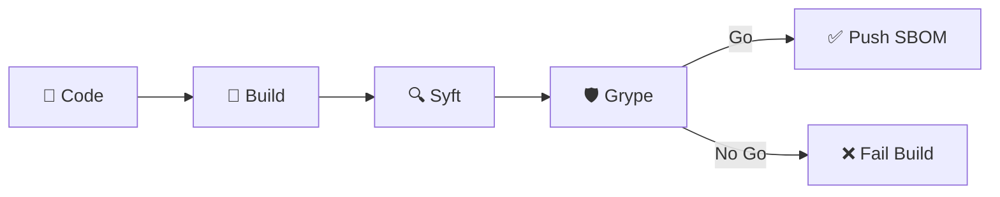

# OWASP Montréal

## Mars 2026

<div class="text-lg mt-4 opacity-80">
  C'est SBOM mais il est bon ton SBOM ?
</div>

<div class="abs-br m-6 text-xl">
  <a href="https://github.com/irishlab-io/blog" target="_blank" class="slidev-icon-btn">
    <carbon:logo-github />
  </a>
</div>

<!--
Bienvenue à la conférence OWASP Montréal

Merci à Cybereco de nous prêter le local ainsi qu'à Samuel et Jonathan du chapitre OWASP Montréal pour l'organisation

Aujourd'hui on parle de nomenclature logiciel plus fréquemment appelé Softwar Bill of Material (SBOM).
-->

---
layout: two-cols
layoutClass: gap-8
---

# $ whoami

**Simon HARVEY**

Conseiller principal en DevSecOps @ **Desjardins**

<div class="flex justify-center mt-18">
  
</div>

::right::

<div class="mt-12">

<div class="flex justify-center gap-8 mt-8">
  <a href="https://www.linkedin.com/in/simon-harvey-a0305029/" target="_blank" class="slidev-icon-btn">
    <carbon:logo-linkedin /> LinkedIn
  </a>
  <a href="https://github.com/irish1986" target="_blank" class="slidev-icon-btn">
    <carbon:logo-github /> GitHub
  </a>
</div>

<div class="mt-8 text-sm">

<div class="flex items-center gap-3 mb-3">
  <carbon:security class="text-blue-400 text-lg flex-shrink-0" />
  <span>Équipe de <strong>Sécurité Applicative</strong></span>
</div>

<div class="flex items-center gap-3 mb-3">
  <carbon:time class="text-blue-400 text-lg flex-shrink-0" />
  <span>20 ans en aéronautique, défense et finances</span>
</div>

<div class="flex items-center gap-3 mb-3">
  <carbon:earth class="text-blue-400 text-lg flex-shrink-0" />
  <span>Canada, États-Unis, Mexique et Irlande du Nord</span>
</div>

<div class="flex items-center gap-3">
  <carbon:deploy class="text-blue-400 text-lg flex-shrink-0" />
  <span>DevSecOps, CI/CD, SDLC, Supply Chain Security</span>
</div>

</div>

</div>

<!--
Petite introduction rapide pour moi, je m'appelle Simon HARVEY et je suis conseiller principale en DevSecOps chez Desjardins.

Je fais parti de l'équipe de Sécurité Applicative et notre mandat est d'amélioer les pratiques et soutenir les équipes de développement logiciel.

Ça fait 20 ans que je suis dans les TI, au début de ma carrière plutôt dans l'aéronautique et la defense.

Nous pouvez me trouver sur LinkedIn ou GitHub.
-->

---

# Agenda

<div class="grid grid-cols-2 gap-x-8 gap-y-4 mt-8">

<div class="flex items-start gap-4 p-3 rounded-lg bg-blue-500/10 border-l-3 border-blue-400">
  <div class="text-xl font-bold opacity-40">01</div>
  <div>
    <div class="font-bold">Gastronomie vs SBOM</div>
    <div class="text-sm opacity-60">Comprendre le concept</div>
  </div>
</div>

<div class="flex items-start gap-4 p-3 rounded-lg bg-blue-500/10 border-l-3 border-blue-400">
  <div class="text-xl font-bold opacity-40">02</div>
  <div>
    <div class="font-bold">C'est quoi un SBOM ?</div>
    <div class="text-sm opacity-60">Formats, réglementation et evenements</div>
  </div>
</div>

<div class="flex items-start gap-4 p-3 rounded-lg bg-green-500/10 border-l-3 border-green-400">
  <div class="text-xl font-bold opacity-40">03</div>
  <div>
    <div class="font-bold">Générer et analyser</div>
    <div class="text-sm opacity-60">Syft, Grype et l'intégration CI</div>
  </div>
</div>

<div class="flex items-start gap-4 p-3 rounded-lg bg-purple-500/10 border-l-3 border-purple-400">
  <div class="text-xl font-bold opacity-40">04</div>
  <div>
    <div class="font-bold">Conserver vos SBOMs </div>
    <div class="text-sm opacity-60">OWASP Dependency-Track</div>
  </div>
</div>

<div class="flex items-start gap-4 p-3 rounded-lg bg-orange-500/10 border-l-3 border-orange-400">
  <div class="text-xl font-bold opacity-40">05</div>
  <div>
    <div class="font-bold">Commencer la remédiation</div>
    <div class="text-sm opacity-60">Quoi faire et l'automatisation</div>
  </div>
</div>

<div class="flex items-start gap-4 p-3 rounded-lg bg-teal-500/10 border-l-3 border-teal-400">
  <div class="text-xl font-bold opacity-40">06</div>
  <div>
    <div class="font-bold">En résumé</div>
    <div class="text-sm opacity-60">Le cyle de vie complète du SBOM</div>
  </div>
</div>

</div>

<!--
Petit survol de notre agenda, on se donne un 45-60min aujourd'hui pour parler de SBOM alors ça fait beaucoup de matière à couvrir.
-->

---
layout: center
class: text-center
---

# Partie 1

## Nomenclature Logiciel

<div class="mt-8 text-sm opacity-60">

Software Bill of Material ?

</div>

---

# Gastronomie vs SBOM

Chaque plat est composé d'une **liste d'ingrédients** — pourquoi la connaître ?

<div class="grid grid-cols-2 gap-6 mt-8">

<div v-click class="flex items-start gap-4 p-4 rounded-lg bg-blue-500/10 border-l-3 border-blue-400">
  <div class="text-3xl flex-shrink-0">🍽️</div>
  <div>
    <div class="font-bold text-blue-300">Préférences</div>
    <div class="text-sm opacity-75 mt-1">Certains clients n'aiment pas certains aliments et veulent <strong>savoir</strong> ce qu'il y a dans chaque plat.</div>
  </div>
</div>

<div v-click class="flex items-start gap-4 p-4 rounded-lg bg-green-500/10 border-l-3 border-green-400">
  <div class="text-3xl flex-shrink-0">🥬</div>
  <div>
    <div class="font-bold text-green-300">Fraîcheur</div>
    <div class="text-sm opacity-75 mt-1">Des convives choisissent un endroit pour les techniques utilisées lors de la <strong>préparation</strong>.</div>
  </div>
</div>

<div v-click class="flex items-start gap-4 p-4 rounded-lg bg-purple-500/10 border-l-3 border-purple-400">
  <div class="text-3xl flex-shrink-0">🌱</div>
  <div>
    <div class="font-bold text-purple-300">Convictions</div>
    <div class="text-sm opacity-75 mt-1">Végéta(l|r)iens, religieuses ou éthiques — ils ont besoin de <strong>vérifier</strong> que le plat respecte leurs principes.</div>
  </div>
</div>

<div v-click class="flex items-start gap-4 p-4 rounded-lg bg-red-500/10 border-l-3 border-red-400">
  <div class="text-3xl flex-shrink-0">🚨</div>
  <div>
    <div class="font-bold text-red-300">Allergies</div>
    <div class="text-sm opacity-75 mt-1">Allergiques et intolérances — un ingrédient caché peut être <strong>mortel</strong>.</div>
  </div>
</div>

</div>

<!--
Petit analogie entre la gastronomie et le SBOM.
-->

---

# C'est quoi un SBOM ?

Un **Software Bill of Materials** — l'inventaire de tous les composantes et dépendances de votre logiciel.

<div class="grid grid-cols-1 gap-3 mt-8">

<div v-click class="flex items-center gap-3 p-3 rounded-lg bg-blue-500/10 border-l-3 border-blue-400">
  <div class="text-xl flex-shrink-0">📜</div>
  <div><strong class="text-blue-300">Conformité réglementaire</strong> — <a href="https://www.nist.gov/itl/executive-order-14028-improving-nations-cybersecurity">US EO 14028</a>, <a href="https://eur-lex.europa.eu/eli/reg/2024/2847/oj">EU Cyber Resilience Act</a>, <span class="line-through opacity-50">Canadian Bill C-26</span></div>
</div>

<div v-click class="flex items-center gap-3 p-3 rounded-lg bg-green-500/10 border-l-3 border-green-400">
  <div class="text-xl flex-shrink-0">🔗</div>
  <div><strong class="text-green-300">Chaîne d'approvisionnement</strong> — Comprendre ce qui est inclus dans nos produits</div>
</div>

<div v-click class="flex items-center gap-3 p-3 rounded-lg bg-orange-500/10 border-l-3 border-orange-400">
  <div class="text-xl flex-shrink-0">⚙️</div>
  <div><strong class="text-orange-300">Risques opérationnels</strong> — Garder les libraries et modules à jour</div>
</div>

<div v-click class="flex items-center gap-3 p-3 rounded-lg bg-red-500/10 border-l-3 border-red-400">
  <div class="text-xl flex-shrink-0">🛡️</div>
  <div><strong class="text-red-300">Vulnérabilités</strong> — Identifier rapidement quelles applications sont affectées</div>
</div>

<div v-click class="flex items-center gap-3 p-3 rounded-lg bg-purple-500/10 border-l-3 border-purple-400">
  <div class="text-xl flex-shrink-0">⚖️</div>
  <div><strong class="text-purple-300">Licences</strong> — Permisibilité d'utiliser certaines dépendences dans certain contexte</div>
</div>

</div>

<!--
Expliquer c'est quoi un SBOM.
-->

---

# Les formats SBOM

Trois standards principaux pour décrire vos composantes logicielles.

<div class="grid grid-cols-3 gap-6 mt-8">

<div v-click class="p-5 rounded-lg bg-green-500/10 border-l-3 border-green-400">
  <div class="font-bold text-3xl text-green-300">CycloneDX</div>
  <div class="text-xs opacity-50 mb-3">OWASP</div>
  <ul class="text-sm opacity-75 space-y-1">
    <li>Léger et moderne</li>
    <li>Conçu pour la sécurité applicative</li>
    <li>Idéal pour CI/CD</li>
    <li>Supporte logiciels, services, matériel</li>
  </ul>
</div>

<div v-click class="p-5 rounded-lg bg-blue-500/10 border-l-3 border-blue-400">
  <div class="font-bold text-3xl  text-blue-300">SPDX</div>
  <div class="text-xs opacity-50 mb-3">Linux Foundation</div>
  <ul class="text-sm opacity-75 space-y-1">
    <li>Standard ISO/IEC 5962:2021</li>
    <li>Orienté licences & propriété intellectuelle</li>
    <li>Conformité légale détaillée</li>
  </ul>
</div>

<div v-click class="p-5 rounded-lg bg-orange-500/10 border-l-3 border-orange-400">
  <div class="font-bold text-3xl text-orange-300">SWID Tags</div>
  <div class="text-xs opacity-50 mb-3">ISO/IEC 19770-2</div>
  <ul class="text-sm opacity-75 space-y-1">
    <li>Tags d'identité & version</li>
    <li>Pas un SBOM complet</li>
    <li>Complémentaire aux autres formats</li>
  </ul>
</div>

</div>

<!--
Pour la plupart d'entre vous, le format CycloneDX est le plus pratique mais selon le produits que vous batissez, vous pourriez être mener vers les autres formats.
-->

---

# La boîte à outils

La compagnie [Anchore](https://anchore.com/) produit deux logiciels plutôt pratique enlien avec les SBOMs.

<div class="grid grid-cols-2 gap-8 mt-8">
<div>

<v-click>
<div class="flex items-center justify-center gap-3 mb-4">
  
  <span class="text-2xl font-bold">Syft</span>
</div>

**Génération de SBOM**

- CLI pour conteneurs, systèmes, archives et autres
- Couvre une douzaine d'écosystème (Alpine (apk), Debian (dpkg), Go, Python, Java, JavaScript, Rust, PHP, .NET, et plus)
- Supporte plusieurs les formats (CycloneDX, SPDX, Syft JSON, et plus)

```bash
curl -sSfL https://get.anchore.io/syft \
  | sudo sh -s -- -b /usr/local/bin
syft version
```

</v-click>
</div>
<div>

<v-click>
<div class="flex items-center justify-center gap-3 mb-4">
  
  <span class="text-2xl font-bold">Grype</span>
</div>

**Scanner de vulnérabilités**

- Balaie les images, filesystems et SBOMs pour des vulnérabilités connues
- Multiples bases de données de CVEs
- Priorise les découvertes et risques via CVE, CVSS, EPSS, KEV et plus
- Base de donnée mise à jour automatiquement

```bash
curl -sSfL https://get.anchore.io/grype \
  | sudo sh -s -- -b /usr/local/bin
grype version
```

</v-click>
</div>
</div>

<!--
Donc comme à l'habitude, je suis pas ici pour vendre quoi que se soit... Alors je vais parler d'outil open-source (Apache 2.0).

La compagnie Anchore propose deux logiciels pour générer et analyser des SBOM.
-->

---

# Démo | Syft

Une petite démo sur l'utilisation de Syft.

<div class="mt-8">

```bash
syft scan docker.io/python:3.10.11-bullseye
```

</div>

<div class="mt-4">

```bash {all|1-7|8-12|13}
 ✔ Loaded image     index.docker.io/library/python:3.10.11-bullseye
 ✔ Parsed image     sha256:df5a406e13...
 ✔ Cataloged contents  234638db60e254...
   ├── ✔ Packages                        [445 packages]
   ├── ✔ Executables                     [1,412 executables]
   ├── ✔ File metadata                   [19,451 locations]
   └── ✔ File digests                    [19,451 files]
NAME                          VERSION            TYPE
apt                           2.2.4              deb
automake                      1:1.16.3-2         deb
autotools-dev                 20180224.1+nmu1    deb
bash                          5.1-2+deb11u1      deb
... and many more
```

</div>

<div class="mt-4">

```bash
syft scan docker.io/python:3.10.11-bullseye --output cyclonedx-json=sbom.json
```

</div>

<!--
Démo en live.

Parler 30 sec de IBC.
-->

---

# Démo | Grype

Une petite démo sur l'utilisation de Grype.

<div class="mt-8">

```bash
grype docker.io/python:3.10.11-bullseye
```

</div>

<div class="mt-4">

```bash {all|1-3|4-11|12}
 ✔ Scanned for vulnerabilities     [3104 vulnerability matches]
   ├── by severity: 224 critical, 1840 high, 3128 medium, 177 low, 1084 negligible (719 unknown)
   └── by status:   4123 fixed, 3049 not-fixed, 4068 ignored (1 dropped)
NAME              INSTALLED              FIXED IN               TYPE VULNERABILITY   SEVERITY  EPSS          RISK
libwebp-dev       0.6.1-2.1+deb11u1      0.6.1-2.1+deb11u2      deb  CVE-2023-4863   High      93.6% (99th)  85.6  KEV
libwebp6          0.6.1-2.1+deb11u1      0.6.1-2.1+deb11u2      deb  CVE-2023-4863   High      93.6% (99th)  85.6  KEV
libfreetype-dev   2.10.4+dfsg-1+deb11u1  2.10.4+dfsg-1+deb11u2  deb  CVE-2025-27363  High      76.2% (98th)  81.9  KEV
git               1:2.30.2-1+deb11u2     1:2.30.2-1+deb11u3     deb  CVE-2024-32002  Critical  80.4% (99th)  72.3
git-man           1:2.30.2-1+deb11u2     1:2.30.2-1+deb11u3     deb  CVE-2024-32002  Critical  80.4% (99th)  72.3
libc-bin          2.31-13+deb11u6        2.31-13+deb11u9        deb  CVE-2024-2961   High      92.8% (99th)  68.7
libc-dev-bin      2.31-13+deb11u6        2.31-13+deb11u9        deb  CVE-2024-2961   High      92.8% (99th)  68.7
... and many more
```

</div>

<v-click>

<div class="flex justify-center gap-3 mt-6">
  <div class="px-4 py-2 rounded-lg bg-red-600/20 border border-red-500 text-center">
    <div class="text-2xl font-bold text-red-400">224</div>
    <div class="text-xs opacity-75">Critical</div>
  </div>
  <div class="px-4 py-2 rounded-lg bg-orange-500/20 border border-orange-500 text-center">
    <div class="text-2xl font-bold text-orange-400">1840</div>
    <div class="text-xs opacity-75">High</div>
  </div>
  <div class="px-4 py-2 rounded-lg bg-yellow-500/20 border border-yellow-500 text-center">
    <div class="text-2xl font-bold text-yellow-400">3128</div>
    <div class="text-xs opacity-75">Medium</div>
  </div>
  <div class="px-4 py-2 rounded-lg bg-blue-500/20 border border-blue-500 text-center">
    <div class="text-2xl font-bold text-blue-400">177</div>
    <div class="text-xs opacity-75">Low</div>
  </div>
  <div class="px-4 py-2 rounded-lg bg-gray-500/20 border border-gray-500 text-center">
    <div class="text-2xl font-bold text-gray-400">1084</div>
    <div class="text-xs opacity-75">Trivial</div>
  </div>
</div>

</v-click>

<!--
Démo en live.
-->

---

# Intégration CI/CD

Générer un SBOM dans un pipeline, c'est **3 petites étapes de plus** dans votre CI :

<div class="mt-8">



</div>

<v-click>

<div class="mt-6">

Le seuil de blocage selon la criticité des CVE rencontrés se configure ainsi :

```bash
grype sbom:sbom.json --fail-on <-severity->
```

</div>

</v-click>

<v-click>

<div class="grid grid-cols-3 gap-3 mt-4 text-center text-sm">
  <div class="p-2 rounded-lg bg-blue-500/10 border border-blue-500/30">
    <div class="font-bold text-blue-300">Feature branch</div>
    <div class="text-xs opacity-60"><code>--fail-on critical</code></div>
  </div>
  <div class="p-2 rounded-lg bg-orange-500/10 border border-orange-500/30">
    <div class="font-bold text-orange-300">Dev branch</div>
    <div class="text-xs opacity-60"><code>--fail-on high</code></div>
  </div>
  <div class="p-2 rounded-lg bg-red-500/10 border border-red-500/30">
    <div class="font-bold text-red-300">Main branch</div>
    <div class="text-xs opacity-60"><code>--fail-on medium</code></div>
  </div>
</div>

</v-click>

<!--
Inclure la génération et analye de SBOM dans vos pipeline d'intégration.
-->

---

# Les vulnérabilités

Quatre acronymes essentiels pour comprendre et prioriser les vulnérabilités :

<div class="grid grid-cols-4 gap-4 mt-8">

<div v-click class="p-4 rounded-lg bg-blue-500/10 border-l-3 border-blue-400">
  <div class="font-bold text-xl text-blue-300 mb-2">CVE</div>
  <div class="text-xs opacity-50 mb-2">Common Vulnerabilities and Exposures</div>
  <div class="text-sm opacity-75">
    <strong>Identifiant unique</strong> pour chaque vulnérabilité connue (ex: <code>CVE-2024-6119</code>). Géré par le NVD, c'est la <strong>carte d'identité</strong> d'une faille.
  </div>
  <div class="mt-3 p-2 bg-blue-500/10 rounded text-xs opacity-60">
    <strong>"C'est quoi cette faille ?"</strong>
  </div>
</div>

<div v-click class="p-4 rounded-lg bg-orange-500/10 border-l-3 border-orange-400">
  <div class="font-bold text-xl text-orange-300 mb-2">CVSS</div>
  <div class="text-xs opacity-50 mb-2">Common Vulnerability Scoring System</div>
  <div class="text-sm opacity-75">
    Score de <strong>0.0 à 10.0</strong> mesurant la sévérité technique. Évalue le vecteur d'attaque, la complexité et l'impact.
  </div>
  <div class="mt-3 grid grid-cols-2 gap-1 text-xs">
    <span class="px-1 rounded bg-red-600/30 text-red-300">Critical</span>
    <span class="px-1 rounded bg-orange-500/30 text-orange-300">High</span>
    <span class="px-1 rounded bg-yellow-500/30 text-yellow-300">Medium</span>
    <span class="px-1 rounded bg-blue-500/30 text-blue-300">Low</span>
  </div>
  <div class="mt-2 p-2 bg-orange-500/10 rounded text-xs opacity-60">
    <strong>"C'est grave comment ?"</strong>
  </div>
</div>

<div v-click class="p-4 rounded-lg bg-green-500/10 border-l-3 border-green-400">
  <div class="font-bold text-xl text-green-300 mb-2">EPSS</div>
  <div class="text-xs opacity-50 mb-2">Exploit Prediction Scoring System</div>
  <div class="text-sm opacity-75">
    Probabilité (<strong>0 à 100%</strong>) qu'une CVE soit <strong>exploitée dans les 30 prochains jours</strong>. Basé sur des projections et des données de menaces réelles.
  </div>
  <div class="mt-3 p-2 bg-green-500/10 rounded text-xs opacity-60">
    <strong>"Est-ce qu'on va se faire attaquer ?"</strong>
  </div>
</div>

<div v-click class="p-4 rounded-lg bg-red-500/10 border-l-3 border-red-400">
  <div class="font-bold text-xl text-red-300 mb-2">KEV</div>
  <div class="text-xs opacity-50 mb-2">Known Exploited Vulnerabilities</div>
  <div class="text-sm opacity-75">
    Catalogue de la <strong>CISA</strong> listant les CVEs <strong>activement exploitées</strong> dans la nature. Si votre CVE est dans le KEV, c'est une urgence.
  </div>
  <div class="mt-3 p-2 bg-red-500/10 rounded text-xs opacity-60">
    <strong>"Est-ce que c'est déjà exploité ?"</strong>
  </div>
</div>

</div>

<v-click>

<div class="mt-6 p-3 bg-purple-500/10 rounded-lg text-sm text-center">

**CVSS** donne la sévérité, **EPSS** estime la probabilité, **KEV** confirme l'exploitation — combinez les trois pour **prioriser efficacement**

</div>

</v-click>

---

# Dégradation d'un artefact

Le logiciel **se dégrade avec le temps** — de nouvelles CVEs apparaissent constamment.

<div class="flex items-center justify-between mt-8 px-4">

<v-click>
  <div class="text-center p-4 rounded-xl bg-green-500/20 border-2 border-green-400 w-40">
    <div class="font-bold text-green-300">4L</div>
    <div class="text-2xl font-bold text-green-400 mt-1">4</div>
    <div class="text-xs opacity-60">CVEs</div>
  </div>

</v-click>

<v-click>
  <div class="text-sm opacity-50 flex flex-col items-center">
    <span class="text-xs">3 mois</span>
  </div>

</v-click>

<v-click>
  <div class="text-center p-4 rounded-xl bg-yellow-500/20 border-2 border-yellow-400 w-40">
    <div class="font-bold text-yellow-300">2H-6M-4L</div>
    <div class="text-2xl font-bold text-yellow-400 mt-1">12</div>
    <div class="text-xs opacity-60">CVEs</div>
  </div>

</v-click>

<v-click>
  <div class="text-sm opacity-50 flex flex-col items-center">
    <span class="text-xs">6 mois</span>
  </div>

</v-click>

<v-click>
  <div class="text-center p-4 rounded-xl bg-orange-500/20 border-2 border-orange-400 w-40">
    <div class="font-bold text-yellow-300">3C-H-M-L</div>
    <div class="text-2xl font-bold text-orange-400 mt-1">45</div>
    <div class="text-xs opacity-60">CVEs</div>
  </div>

</v-click>

<v-click>
  <div class="text-sm opacity-50 flex flex-col items-center">
    <span class="text-xs">12 mois</span>
  </div>

</v-click>

<v-click>
  <div class="text-center p-4 rounded-xl bg-red-500/20 border-2 border-red-400 w-40">
    <div class="font-bold text-yellow-300">11C-H-M-L</div>
    <div class="text-2xl font-bold text-red-400 mt-1">119</div>
    <div class="text-xs opacity-60">CVEs</div>
  </div>

</v-click>
</div>

<v-click>
<div class="mt-8 p-3">

- Re-balayer régulièrement vos produits pour de **nouvelles vulnérabilités**
- Stockez vos SBOMs pour le balyage de **moyen à long terme**
- À échelle, balayer des SBOMs est **beaucoup plus rapide** que scanner des artefacts complets

</div>

</v-click>

<!--
Les vulnérabilités évoluent dans le temps.  C'est un combat sans fin.
-->

---
layout: center
class: text-center
---

# Partie 2

## OWASP Dependency-Track

<div class="mt-8 text-sm opacity-60">

De la génération ponctuelle au **monitoring continu**

</div>

---

# Le problème de stockage

Où mettre tous ces SBOMs et comment les conserver ?

<div class="grid grid-cols-3 gap-4 mt-8">
<div v-click class="p-4 rounded-lg bg-gray-500/10 border-l-3 border-gray-400 text-center opacity-50">

### Stockage ?
📦
<div class="text-sm mt-2">Passif sans de monitoring</div>

</div>
<div v-click class="p-4 rounded-lg bg-gray-500/10 border-l-3 border-gray-400 text-center opacity-50">

### Registre ?
🗄️
<div class="text-sm mt-2">Attaché au build, pas de vue d'ensemble</div>

</div>
<div v-click class="p-4 rounded-lg bg-gray-500/10 border-l-3 border-gray-400 text-center opacity-50">

### Logs ?
📋
<div class="text-sm mt-2">Éphémère, dispersé et difficile à échelonner</div>

</div>
</div>

<!--
Comme expliquer plutot, on veut conserver nos SBOM afin de

Que se soit pour pouvoir les ré-évaluer périodiquement ou en lien avec un evenement (vulnérabilité médiatisée).
-->

---

# OWASP Dependency-Track

Un **OWASP Flagship Project** peut se déploiement rapide via `Docker Compose` :

<div class="grid grid-cols-2 gap-6 mt-12">

<v-click>
<div class="text-sm self-center">

- **Entrepôt SBOM**
- **Tableau de bord**
- **Gestion de politique**
- **Monitoring continu**
- **API-driven et Automatisation**
- **Apache 2.0**

</div>

</v-click>

<v-click>
<div class="text-sm">

```yaml
---
# compose.yml
# docker compose up
services:
  dtrack:
    container_name: dependencytrack
    image: docker.io/dependencytrack/bundled:latest
    deploy:
      resources:
        limits:
          memory: 12288m
        reservations:
          memory: 8192m
    ports:
      - 8080:8080
    volumes:
      - dependency-track:/data
    restart: unless-stopped
```

</div>
</v-click>
</div>

<!--
Si vous souhaitez tester OWASP Dependency Track, il y a plusieurs options d'hébergemement (docker, k8s, helm).

Pour le backend, il y a plusieurs options de base de donnée (postgres, mssql, etc...)

C'est un service plutot simple à stand up qui peut aider à centraliser les différents processus autour des SBOMs.
-->

---

# Démo | OWASP D-Track

Une petite démo sur l'utilisation de Dependency Track.

<div class="grid grid-cols-2 gap-8 mt-8">

<v-clicks>
<div>

### Portfolio


- Vue global, par collection ou par projet
- Infos des projets, composantes et, vulnérabilités
- Tendances de score de risque
- Analyse d'impact


</div>
</v-clicks>
<v-clicks>
<div>

### Moteur de politiques


- **Sécurité** : CVE, CVSS, EPSS, etc ...
- **Licences** : Strong Copyleft ou Risky License
- **Opérationnel** : Sources fiables, EOL, MAJ, etc ...


</div>
</v-clicks>
</div>

<v-clicks>
<div class="mt-8">

```bash
dtrack-cli --server ${DEPENDENCYTRACK_URL} \
  --api-key ${DEPENDENCYTRACK_TOKEN}  \
  --project-name "A-demo-test" --project-version "0.0.1" \
  --bom-path sbom.json --auto-create true
```

</div>
</v-clicks>

<!--
https://dependencytrack.local.irishlab.io/

Projet Dependency Check  12.2.0 comme exemple

Montrer un exemple avec API
-->

---
layout: center
class: text-center
---

# Partie 3

## La remédiation

<div class="mt-8 text-sm opacity-60">

Détecter c'est bien; **corriger** c'est mieux.

</div>

---

# Exemple de projet fictivement réel

[**Insecure Bank Corporation**](https://github.com/irishlab-io/ibc) — une application Django volontairement vulnérable pour fins éducatives.

<div class="mt-8">

- Une web application **Django 4.2.4** en **Python 3.10**
- Plusieurs dépendances vulnérables (PyYAML 5.3.1, etc.)
- Image conteneur lourde `python:3.10.11-bullseye`

</div>

<div class="mt-6">

```bash
zi ibc
make talk
```

</div>

<v-click>

<div class="mt-12 p-3 bg-orange-500/10 rounded-lg text-sm text-center">

Les dashboards clignotent en rouge — **quelqu'un** doit corriger toutes ces dépendances.

</div>

</v-click>

---

# Stratégies de remédiation

Au-delà de l'automatisation, quelques réflexions :

<div class="mt-10">

<div v-click class="grid grid-cols-[1fr_auto_1fr] items-center gap-x-4 mb-3">
  <div class="p-3 rounded-lg bg-red-500/10 border-l-3 border-red-400">
    <div class="font-bold text-red-300">1. Bibliothèques vieillissantes</div>
    <div class="text-xs opacity-60 mt-1">Dépendances Python obsolètes avec CVEs connues</div>
  </div>
  <div class="text-xl opacity-50">→</div>
  <div class="p-3 rounded-lg bg-green-500/10 border-l-3 border-green-400">
    <div class="font-bold text-green-300">1. <code>pyproject.toml</code> upgrade</div>
    <div class="text-xs opacity-60 mt-1">Mettre à jour les dépendances directes</div>
  </div>
</div>

<div v-click class="grid grid-cols-[1fr_auto_1fr] items-center gap-x-4 mb-3">
  <div class="p-3 rounded-lg bg-red-500/10 border-l-3 border-red-400">
    <div class="font-bold text-red-300">2. Image <code>full</code></div>
    <div class="text-xs opacity-60 mt-1">Embarque des centaines de paquets vulnérables et non nécessaire</div>
  </div>
  <div class="text-xl opacity-50">→</div>
  <div class="p-3 rounded-lg bg-green-500/10 border-l-3 border-green-400">
    <div class="font-bold text-green-300">2. Image <code>alpine</code></div>
    <div class="text-xs opacity-60 mt-1">Image minimale, surface d'attaque réduite</div>
  </div>
</div>

<div v-click class="grid grid-cols-[1fr_auto_1fr] items-center gap-x-4 mb-3">
  <div class="p-3 rounded-lg bg-red-500/10 border-l-3 border-red-400">
    <div class="font-bold text-red-300">3. Dépendances de dev incluses</div>
    <div class="text-xs opacity-60 mt-1">Outils de test et debug embarqués en production</div>
  </div>
  <div class="text-xl opacity-50">→</div>
  <div class="p-3 rounded-lg bg-green-500/10 border-l-3 border-green-400">
    <div class="font-bold text-green-300">3. Bibliothèques superflues</div>
    <div class="text-xs opacity-60 mt-1">Packages installés mais jamais utilisés</div>
  </div>
</div>

<div v-click class="grid grid-cols-[1fr_auto_1fr] items-center gap-x-4 mb-3">
  <div class="p-3 rounded-lg bg-red-500/10 border-l-3 border-red-400">
    <div class="font-bold text-red-300">4. Imagie généraliste</div>
    <div class="text-xs opacity-60 mt-1">DockerHub, Quay, GHCR, etc...</div>
  </div>
  <div class="text-xl opacity-50">→</div>
  <div class="p-3 rounded-lg bg-green-500/10 border-l-3 border-green-400">
    <div class="font-bold text-green-300">4. Zéro CVE Image</div>
    <div class="text-xs opacity-60 mt-1">Docker Harden Image, Chainguard, Golden Image, etc...</div>
  </div>
</div>

<div v-click class="grid grid-cols-[1fr_auto_1fr] items-center gap-x-4">
  <div class="p-3 rounded-lg bg-red-500/10 border-l-3 border-red-400">
    <div class="font-bold text-red-300">5. Ce qui reste</div>
    <div class="text-xs opacity-60 mt-1">Vulnérabilités sans correctif disponible</div>
  </div>
  <div class="text-xl opacity-50">→</div>
  <div class="p-3 rounded-lg bg-green-500/10 border-l-3 border-green-400">
    <div class="font-bold text-green-300">5. Gestion de risque</div>
    <div class="text-xs opacity-60 mt-1">Évaluer le risque et l'impact</div>
  </div>
</div>

</div>

<!--
Démo dans IBC sur comment évolue le niveau de risque d'un projet via D-Track.
-->

---

# Automatisation les mises à jour

Automatisez la création de PR pour garder vos dépendances à jour.

<div class="grid grid-cols-2 gap-6 mt-8">

<div v-click class="p-5 rounded-lg bg-blue-500/10 border-l-3 border-blue-400">
  <div class="flex items-center gap-3 mb-2">
    
    <div class="font-bold text-2xl text-blue-300">Dependabot</div>
  </div>
  <div class="text-xs opacity-50 mb-3">GitHub</div>
  <ul class="text-sm opacity-75 space-y-1">
    <li>Intégré nativement à GitHub</li>
    <li>Supporte 15+ écosystèmes</li>
    <li>Alertes de sécurité automatiques</li>
    <li>Configuration simple via <code>.github/dependabot.yml</code></li>
    <li>Groupement de PRs disponible</li>
  </ul>
</div>

<div v-click class="p-5 rounded-lg bg-teal-500/10 border-l-3 border-teal-400">
  <div class="flex items-center gap-3 mb-2">
    
    <div class="font-bold text-2xl text-teal-300">Renovate Bot</div>
  </div>
  <div class="text-xs opacity-50 mb-3">Mend.io</div>
  <ul class="text-sm opacity-75 space-y-1">
    <li>Multi-plateforme (GitHub, GitLab, Bitbucket, etc...)</li>
    <li>Configuration très flexible et granulaire</li>
    <li>Auto-merge avec règles personnalisées</li>
    <li>Support des monorepos avancé</li>
    <li>Dashboards et rapports détaillés</li>
  </ul>
</div>

</div>

<div v-click class="mt-6 p-4 rounded-lg bg-purple-500/10 border-l-3 border-purple-400">
  <div class="font-bold text-purple-300 mb-2">D'autres outils</div>
  <div class="grid grid-cols-4 gap-2 text-sm opacity-75">
    <span>• Black Duck</span>
    <span>• Checkmarx</span>
    <span>• Cycode</span>
    <span>• FOSSA</span>
    <span>• Semgrep</span>
    <span>• Snyk</span>
    <span>• Trivy</span>
    <span>• WizCode</span>
  </div>
</div>

<!--
Dependabot est la solution native de GitHub, très simple à configurer.
Renovate offre plus de flexibilité et fonctionne sur plusieurs plateformes.
Les deux peuvent créer automatiquement des PRs de mise à jour de dépendances.
-->

---

# <code>tl;dr</code>

Les points essentiels à retenir.

<div class="grid grid-cols-3 gap-4 mt-8">

<div v-click class="p-4 rounded-lg bg-blue-500/10 border-l-3 border-blue-400">
  <div class="font-bold text-blue-300 mb-1">Générez des SBOMs</div>
  <div class="text-sm opacity-75">Intégrez <strong>Syft</strong> dans votre CI — chaque build produit son inventaire</div>
</div>

<div v-click class="p-4 rounded-lg bg-red-500/10 border-l-3 border-red-400">
  <div class="font-bold text-red-300 mb-1">Scannez tôt, scannez souvent</div>
  <div class="text-sm opacity-75"><strong>Grype</strong> bloque les CVEs critiques avant qu'elles n'atteignent la production</div>
</div>

<div v-click class="p-4 rounded-lg bg-green-500/10 border-l-3 border-green-400">
  <div class="font-bold text-green-300 mb-1">Monitoring continu</div>
  <div class="text-sm opacity-75"><strong>Dependency-Track</strong> surveille vos SBOMs 24/7 — pas juste au build</div>
</div>

<div v-click class="p-4 rounded-lg bg-orange-500/10 border-l-3 border-orange-400">
  <div class="font-bold text-orange-300 mb-1">Politiques & alertes</div>
  <div class="text-sm opacity-75">Définissez vos seuils de tolérance — le pipeline décide, pas l'humain</div>
</div>

<div v-click class="p-4 rounded-lg bg-purple-500/10 border-l-3 border-purple-400">
  <div class="font-bold text-purple-300 mb-1">Automatisez la correction</div>
  <div class="text-sm opacity-75">Avec des outils ou structurer des playbooks pour vos équipes internes</div>
</div>

<div v-click class="p-4 rounded-lg bg-teal-500/10 border-l-3 border-teal-400">
  <div class="font-bold text-teal-300 mb-1">Bouclez la boucle</div>
  <div class="text-sm opacity-75"><strong>Détecter → Suivre → Corriger</strong> — la sécurité est un cycle, pas un événement</div>
</div>

</div>

---
layout: center
class: text-center
---

# Merci !

<div class="mt-8 grid grid-cols-2 gap-8">

<div>
  <carbon:logo-github class="text-4xl mb-2" />
  <div class="text-sm">

[irishlab-io](https://github.com/irishlab-io/)

  </div>
</div>

<div>
  <carbon:logo-linkedin class="text-4xl mb-2" />
  <div class="text-sm">

[simon-harvey](https://www.linkedin.com/in/simon-harvey-a0305029/)

  </div>
</div>

</div>

<div class="mt-12 text-2xl">

**Questions ?**

</div>

---

# Ressources

Liens utiles pour aller plus loin.

<div class="grid grid-cols-2 gap-8 mt-8">
<div>

### Outils
- [Syft](https://github.com/anchore/syft) — SBOM generation
- [Grype](https://github.com/anchore/grype) — Vulnerability scanner
- [Dependency-Track](https://dependencytrack.org/) — SBOM management
- [Dependabot](https://docs.github.com/en/code-security/dependabot) — Auto updates

</div>
<div>

### Standards & Specs
- [CycloneDX](https://cyclonedx.org/) — SBOM format
- [SPDX](https://spdx.dev/) — SBOM format
- [OWASP Projects](https://owasp.org/projects/)
- [GitHub Advisory Database](https://github.com/advisories)

</div>
</div>

<div class="mt-8 text-center">

### Blog & Code

<div class="flex justify-center items-center gap-2">
  🌐 <a href="https://irishlab.io">irishlab.io</a> · <carbon:logo-github /> <a href="https://github.com/irishlab-io/blog">irishlab-io/blog</a>
</div>

</div>
